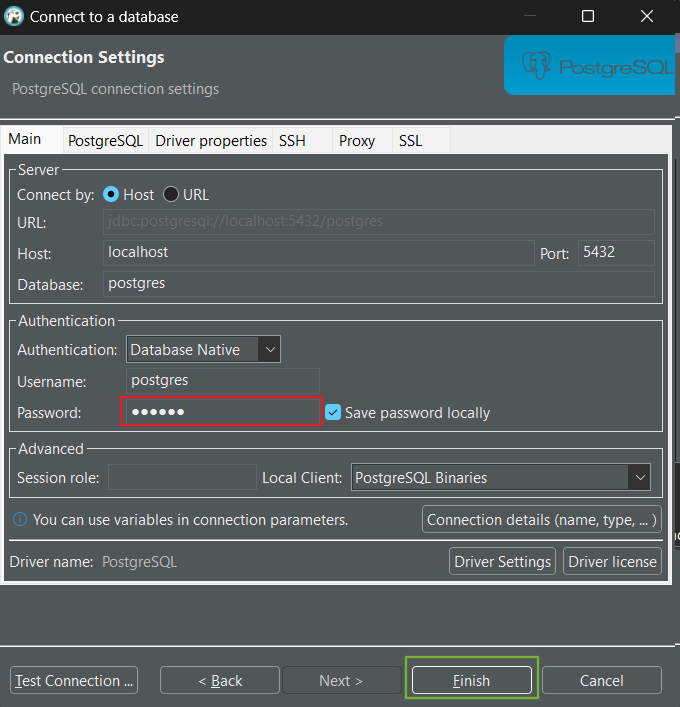
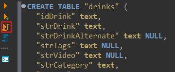

# Documentation

## PROJECT DEFINITION

Our application gives the user the opportunity to use a dropdown menu and choose an ingredient (ex. Gin, Vodka,Cola, Tonic). 
Based on the decision the application checks a database filled with cocktails and provides the user with all the possible cocktails with the chosen ingredient (ex. Gin Tonic, Vodka sour, Cuba Libre).
The Cocktails willl be editable via CRUD (Create, Read, Update, Delete) endpoints.

**Extra**

In a further step the user is able to select a cocktail and sending an e-mail with all the necessary ingredients to their personal mailbox.

Additionally, the user is able to ask for a random cocktail.

## Rules

**Branching Rules**

Never push directly to the main branch.
Always create a new feature branch from the main and create a pull-request to the main branch. 
The branch name starts with the ticket number-name and a short description of the task.
Example: 1-documentation-add-definition


To contribute your work, create a new branch according to the branch naming rules. 
This branch can be used as a topic or feature branch. 
To merge the branch, create a pull-request and ask for a code review. 
Additionally, for the optional learn journal, please create a personal branch, which will be merged at the end of the project.

**Commit Rules**

There is no commit amount limit, but everyone should consider the readability of a branch.
Every commit has a commit message with a short description about the changes inthe commit. 
Force-push is not allowed

**Merge Criteria**

All tests must pass before approving a pull-request.
There are no debug logs allowed in a pull-request.
Every pull-request must be reviewed and approved by at least one other collaborators.

**Meetings** 

The weekly will be every Tuesday at 8:30.
At the meeting the team checks and updates the Kanban board and discusses thetasks in progress.

**Enviroment**

We will write our Frontand in Typescript React and our Backend in Java.
Every collaborator can use the IDE they prever.

## Database

**Setup**

To setup the Docker container use the command given below
```
docker run --name local-postgres -e POSTGRES_PASSWORD=drinks -p 5432:5432 -d postgres
```

When the container is running you can start DBeaver and follow the instructions:

**Step 1**

🔴 Start by klicking the icon shown in the image.


**Step 2**

🔴 Insert "dirnks" in the password area.
🟢 coninue by clicking finish.



**Step 3**

🟢 Aftrer creating a connection, click on SQL in the navbar.


**Step 4**

Insert the SQL statement given 

[SQL file](./drinks_db.sql) 

🔴 Afterwards click the run skript to create a table with data.



## Time

Every collaborator must fill in his own time on the time sheet.
For every work time the collaborator must fill in the task they worked on and the required time.
The time must be entered to the nearest 15 minutes.

[Time Sheet](https://tbzedu-my.sharepoint.com/:x:/r/personal/kay_schnyder_edu_tbz_ch/_layouts/15/Doc.aspx?sourcedoc=%7B4C0BDA20-4AE3-4985-A780-3F4F67B43329%7D&file=time_logger%201.xlsx&action=default&mobileredirect=true&wdOrigin=TEAMS-WEB.p2p_ns.rwc&wdExp=TEAMS-TREATMENT&wdhostclicktime=1724143689247&web=1)


# Theory Calms:

## CALMS Model: A Guide to DevOps Transformation

The CALMS model encapsulates the core principles of DevOps. But first, let's take a step back: What does CALMS stand for?

CALMS is an acronym for five core values:

- **C** for Culture
- **A** for Automation
- **L** for Lean
- **M** for Measurement
- **S** for Sharing

Sometimes, the "Lean" aspect is considered optional, so you may also see the model referred to as CAMS, with CALMS as an extension.

The CALMS model is beneficial for DevOps transformation because it emphasizes that all aspects need to develop together. Culture forms the foundation since no successful transformation can occur without it. Below is an overview of how each aspect of the CALMS model connects with DevOps.

## C for Culture

Culture, in this context, refers to the work culture within the team and organization. It addresses how collaboration occurs among team members, regardless of their roles. In a DevOps environment, the focus is on integrating development (Dev) and operations (Ops) to work together toward a common goal, rather than functioning in isolated silos.

Key to this cultural shift is the frequent release of updates to minimize the time between error detection and correction. Automation plays a significant role in achieving this, enabling teams to confidently roll out changes. However, this requires a cultural foundation where errors are accepted as part of the learning process and continuous improvement is encouraged.

### Cultural Change at TechNova

**Which specific challenges led TechNova Solutions to decide on a DevOps transformation?**

TechNova Solutions faced significant challenges, including long development cycles, slow customer feedback integration, and quality issues due to siloed teams and manual processes. The separation between development and operations teams and a siloed culture exacerbated these problems.

**How was the cultural change at TechNova approached and what specific measures were taken?**

Maria Schmidt, the CEO, addressed the cultural change by organizing workshops and team-building activities to enhance cross-departmental collaboration. A rotation program was introduced to help employees gain insights into other teams' perspectives, breaking down silos and fostering a shared sense of responsibility.

## A for Automation

Automation is about reducing manual processes as much as possible to increase speed. This includes automated testing, building artifacts, deployments, and monitoring after deployment. While automation is essential, it must be complemented by the other CALMS elements, especially a strong culture and proper measurement. A common mistake is to equate DevOps solely with automation, which can lead to automating existing flaws rather than improving processes.

### Automation at TechNova

**What types of automation were introduced and how did they affect the work processes?**

TechNova implemented a CI/CD pipeline that automated testing and deployments. This transition from manual processes significantly improved software quality and deployment speed. Automation allowed the team to focus on strategic activities rather than repetitive tasks, reducing errors and improving overall efficiency.

## L for Lean

The Lean principle, originally from manufacturing, focuses on eliminating waste and continuously improving processes to maximize customer value. In DevOps, Lean encourages trust in the team and software, enabling well-tested experiments on production systems. This principle is crucial for achieving goals faster by determining what works through direct experimentation rather than lengthy discussions.

### Lean Principles at TechNova

**How were Lean principles integrated into the transformation, and what specific tools or methods were used?**

TechNova introduced Lean principles by implementing Kanban boards to visualize work processes and conducting "Gemba Walks" where leaders observed actual workflows to identify improvement areas. This approach helped reduce waste and optimize value flow, leading to a more streamlined and efficient process.

## M for Measurement

Measurement involves using metrics to make informed decisions about what is and isn’t working. Common metrics include Lead Time, which measures the time taken from implementing a customer requirement to its deployment. This helps in assessing the efficiency of processes and the CI/CD pipeline, allowing for better optimization.

### Measurement at TechNova

**What metrics were introduced to measure progress, and how were they used?**

TechNova established metrics such as deployment frequency, lead time for changes, and mean time to recovery (MTTR). These KPIs provided valuable insights into process efficiency and helped the company track improvements, identify bottlenecks, and make data-driven decisions.

## S for Sharing

Sharing is about learning from each other and preventing the repetition of mistakes. It involves documenting problems and lessons learned and sharing this knowledge within and outside the organization. A culture that accepts and learns from errors is essential for this aspect to thrive, impacting the overall culture of the organization.

### Sharing at TechNova

**What methods did TechNova use to promote knowledge sharing and collaboration?**

TechNova set up an internal wiki, organized "Lunch and Learn" sessions, and encouraged employees to share experiences at conferences and through blog posts. This facilitated the exchange of best practices and fostered a culture of continuous learning and collaboration.

## Challenges and Outcomes

**What challenges were faced during the transformation, and how were they addressed?**

Challenges included skepticism from long-standing employees and initial setbacks with new tools and processes. These were addressed through continuous communication, training, and iterative adjustments to the implementation strategy.

**How long did the transformation process take, and what measurable improvements were observed after 18 months?**

The transformation took 18 months. Notable improvements included an increase in deployment frequency from every six months to weekly releases, enhanced customer satisfaction due to quicker feedback implementation, and increased employee satisfaction due to reduced stress and focus on value-adding activities.

**How did the DevOps transformation impact customer satisfaction and TechNova's competitive position?**

The transformation led to faster response times to customer feedback and higher software quality, which improved customer satisfaction. TechNova also gained a competitive edge due to its enhanced ability to adapt to market changes and deliver updates more rapidly.

**What role did CEO Maria Schmidt play in the successful implementation of the CALMS model?**

Maria Schmidt played a pivotal role by spearheading the cultural shift, investing in automation, integrating Lean principles, implementing measurement systems, and fostering a culture of sharing. Her leadership was crucial in driving the transformation and achieving the desired outcomes.

## Sources

- **CALMS Framework**: Insights and best practices derived from internal research and external consultation. [Atlassian](https://www.atlassian.com/de/devops/frameworks/calms-framework)
- **TechNova Solutions Case Study**: Adapted from materials provided by TechNova Solutions and additional context from industry standards.
- Documentation and response generated using resources like ChatGPT and the TechNova Solu****tions case study.
- **Calms concept explanation**: Concept explanation of CALMS and integration process. [QPR](https://www.qrpinternational.ch/blog/faq/was-sind-die-5-calms-devops/)

## The Three Ways
### What are ‘The Three Ways’ in the context of DevOps?
The Three Ways are three fundamental principles of DevOps. They were introduced by Gene Kim in ‘The Phoenix Project’ and offer a structured method to promote efficiency, collaboration and continuous improvement within organisations. The principles are:

- The First Way: Systems Thinking - optimising the workflow by always trying to look at the whole system.
- The Second Way: Amplify Feedback Loops - amplify feedback loops to recognise errors early and make necessary changes.
- The Third Way: Continual Learning and Experimentation - Foster a culture of continuous learning and experimentation to support innovation and adaptability.

These principles have a profound impact on the way an organisation works by improving collaboration between development and operations, increasing quality and strengthening the ability to respond quickly to change.

### What does the ‘First Way: Systems Thinking’ describe?
First Way: Systems Thinking focuses on optimising the entire system and workflow rather than focusing on individual components. It promotes a perspective that views the entire development and deployment process as an interconnected system. Teams learn to understand the entire path of a change from development to production, minimising handovers. In this way, work is made visible and automation is utilised. This view improves collaboration and reduces overlooked errors, leading to more efficient processes and faster development.

### What are the main components of the ‘Second Way: Amplify Feedback Loops’?
The ‘Second Way’ emphasises the importance of fast and continuous feedback loops. The main components include:

- Frequent and small deployments - To enable regular feedback.
- Automated testing - To identify errors early.
- Transparency - To make problems immediately recognisable.
- Interdisciplinary teams - To ensure a holistic view of the system.

These points are crucial to identify and fix problems quickly, resulting in higher quality and reliability of the code.

### Why is ‘The Third Way: Continual Learning and Experimentation’ important?
The Third Way encourages continuous learning and experimentation, which is critical to an organisation's ability to innovate and adapt. A culture that views experiments and mistakes as learning opportunities enables continuous improvement. This attitude leads to an open error culture and encourages employees to develop innovative solutions, which strengthens the company in the long term.

### How does ‘The First Way: Systems Thinking’ contribute to improving the software development process?
‘Systems Thinking’ promotes a holistic view of the development process, which leads to better identification and elimination of bottlenecks. By reducing handovers, visualising work and minimising unnecessary processes, efficiency is increased and the susceptibility to errors is reduced. This leads to faster, more reliable deliveries and greater satisfaction for both customers and internal teams.

### How can the concept of ‘Amplify Feedback Loops’ improve the quality of code?
Amplify feedback loops make it possible to recognise and rectify errors more quickly. Automated tests and frequent deployments provide continuous feedback, which increases the quality of the code by addressing issues early. Rapid feedback allows developers to continuously improve their work and avoid technical debt.

### What role do experiments play in the ‘third way’ and how should they ideally be carried out?
Experiments play a central role in the ‘third way’ as they make it possible to test new approaches and learn from them. Ideally, experiments should be carried out in controlled environments, for example in the form of A/B tests or canary releases, in order to minimise risks. The results should be documented and shared in order to improve the entire development process.

### What challenges can arise when implementing systems thinking and how can these be overcome?
Challenges in implementing systems thinking can include resistance to change, lack of transparency and unclear responsibilities. These obstacles can be overcome through training, clear communication and the introduction of visualisation tools such as Kanban boards. It is important to involve all stakeholders in the process and promote a culture of open collaboration.

### Analyse how the principles of the ‘Three Ways’ can improve collaboration between development teams and operations teams.
The Three Ways encourage close collaboration between development and operations through shared goals, increased communication and continuous feedback. Systems are viewed as a whole, leading to better alignment and fewer misunderstandings. This reduces silos and improves integration, leading to more efficient and reliable processes.

### Develop a plan to implement ‘The Three Ways’ in an organisation that has not yet adopted DevOps practices.
An implementation plan could look like this

1. training and workshops - introducing employees to the principles of DevOps and ‘The Three Ways’.
2. start pilot projects - form small, interdisciplinary teams to test the principles on a limited scale.
3. introduce automation - start automating recurring tasks such as testing and deployment.
4. strengthen feedback loops - implement regular deployments and automated tests.
5. promote a culture of learning - organise regular retrospectives and knowledge sharing within the company.

### Evaluate the impact of ‘The Second Way: Amplify Feedback Loops’ on troubleshooting and continuous improvement in an agile development process.
Amplify feedback loops in the agile process make it possible to recognise errors early and improve them iteratively. This promotes continuous improvement and reduces technical debt. Faster feedback enables adjustments to be made quickly and increases the flexibility and efficiency of the development process.

### Discuss how the principles of ‘The Three Ways’ can be implemented in a highly hierarchical organisation.
In a highly hierarchical organisation, the implementation of ‘The Three Ways’ could take place through a gradual introduction, starting with pilot projects that demonstrate success. Managers need to be sensitised to the principles and won over as advocates. Transparency and communication are key to breaking down silos and creating a culture of trust and collaboration.


## Protokoll

**27.08.2024**

