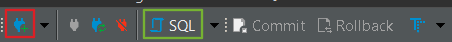

# Documentation

## PROJECT DEFINITION

Our application gives the user the opportunity to use a dropdown menu and choose an ingredient (ex. Gin, Vodka,Cola, Tonic). 
Based on the decision the application checks a database filled with cocktails and provides the user with all the possible cocktails with the chosen ingredient (ex. Gin Tonic, Vodka sour, Cuba Libre).
The Cocktails will be editable via CRUD (Create, Read, Update, Delete) endpoints.

**Extra**

In a further step the user is able to select a cocktail and sending an e-mail with all the necessary ingredients to their personal mailbox.

Additionally, the user is able to ask for a random cocktail.

## Branching

In our project, we adopted a branching strategy that enables parallel development while ensuring the main branch remains stable and ready for deployment. 

### Rules
Never push directly to the main branch. Always create a new feature branch from the main and create a pull-request to the main branch. The branch name starts with the ticket number-name and a short description of the task. Example: 1-documentation-add-definition

To contribute your work, create a new branch according to the branch naming rules. This branch can be used as a topic or feature branch. To merge the branch, create a pull-request and ask for a code review. The branches are deleted after accepting the merge request. Additionally, for the optional learn journal, please create a personal branch, which will be merged at the end of the project.

### Branching Flow:
- **Main Branch**: Holds production-ready code.
- **Develop Branch**: Used for integrating completed features before release.
- **Feature Branches**: Created for new features or bug fixes, named after the ticket (e.g., 36-CI/CD-Theory), linked to backlog tasks.
- **Personal Branches**: Each team member maintains a personal branch for their own notes or experiments, which isn't merged into the main codebase.
- There is no **release branch** currently since the project isn’t releasing code yet.


In this Image we show an example of how our Github Workflow & Commits are being pushed.

### Branching Rules:
- No direct pushes to the main branch.
- Feature branches must be created from the main branch, named after the ticket number and description (e.g., 1-documentation-add-definition).
- Contributions must go through pull-requests, reviewed by at least one collaborator, with branches deleted after merging.

### Commit Rules:
- No commit limit, but messages must be clear and concise.
- No force-pushing allowed.

### Merge Criteria:
- All tests must pass and pipelines must succeed.
- No debug logs are permitted in pull-requests.
- Each pull-request must be reviewed and approved before merging.

This strategy accelerates development, ensures independent work without disrupting the main codebase, and maintains a stable main branch.

**Meetings** 

The weekly will be every Tuesday at 8:30.
At the meeting the team checks and updates the Kanban board and discusses the tasks in progress.
During the meeting, problems are discussed and open tasks are assigned to the members. 
The aim of the meeting is for everyone to know what they need to work on afterwards without having to request further feedback from anyone.

**Enviroment**

We will write our Frontend in Typescript React and our Backend in Java.
Every collaborator can use the IDE they prefer.

**Coding Rules**

- Names of classes should be in camel case. 
- Names of variables and functions should be in lower camel case. 
- Names should be chosen with purpose behind them. 
- Code should be written with readability in mind. Readable code should be understood without having to ask somebody else for an explanation to achieve this the code has to be documented and the functions shouldn't have repeated code and should be kept as small as possible. 
- Logic and endpoints should be unit tested. 
- The application should be built on the REST principals

## Database

**Setup**

To setup the Docker container use the command given below
```
docker run --name local-postgres -e POSTGRES_PASSWORD=drinks -p 5432:5432 -d postgres
```

When the container is running you can start DBeaver and follow the instructions:

**Step 1**

🔴 Start by clicking the icon shown in the image.



**Step 2**

🔴 Insert "drinks" in the password area.
🟢 coninue by clicking finish.


**Step 3**

🟢 Aftrer creating a connection, click on SQL in the navbar.


**Step 4**

Insert the SQL statement given 

[SQL file](./drinks_db.sql) 

🔴 Afterwards click the run script to create a table with data.


**Start the backend**
To start the backend, a terminal must be started in the IDE. 
In the terminal, navigate to the backend using ‘cd’ and execute the following command:

``` docker-compose up -d ```

## Time

Every collaborator must fill in his own time on the time sheet.
For every work time the collaborator must fill in the task they worked on and the required time.
The time must be entered to the nearest 15 minutes.

[Time Sheet](https://tbzedu-my.sharepoint.com/:x:/r/personal/kay_schnyder_edu_tbz_ch/_layouts/15/Doc.aspx?sourcedoc=%7B4C0BDA20-4AE3-4985-A780-3F4F67B43329%7D&file=time_logger%201.xlsx&action=default&mobileredirect=true&wdOrigin=TEAMS-WEB.p2p_ns.rwc&wdExp=TEAMS-TREATMENT&wdhostclicktime=1724143689247&web=1)


## User Stories
The user stories are used to imitate the behavior of a user. 
We can use these stories to build tests and logic into our application.
This simplifies the planning and creation of tickets


## Protocol

### 27.08.2024

**Past Tasks**

For today, **Luca** finished the three-way theory, and **Aryan** finished the CALMS theory. Both of these inputs will be explained at 10 o'clock for the whole group. The script to create and fill the database should be finished as well and will be tested later in the day. 

**Next Task**

As a group, we will now revise our Kanban board and create the new necessary tickets for the next few weeks. In addition to new tasks, we need to distribute story points for each issue, where the rule is that 30 minutes is equal to 1 story point. 

We decided to use a Java backend and a React frontend for our application. 

The next tasks will be distributed as follows:

**Jan** and **Aryan** will create the base of the project, and if they have leftover time, they will start coding. 

**Kay** starts the theory for the DevOps processes. 

**Jan** and **Kay** start setting up the database, and **Jan** writes the necessary documentation for the setup.

**Luca** should write down the coding rules that our team will follow.

### 03.09.2024

**Next Task**

As of today, we as a group will add the descriptions to the Kanban board and fix our time sheet. We also need to push our learning journals and add our teacher as a collaborator. 

For the rest of the day, **Aryan** and **Jan** will work on the backend and the unit tests, as well as the needed user stories. 

**Kay** works on finishing the DevOps theory and helps the other two as soon as she's finished.

### 10.09.2024

**Next Task**

In todays meeting we discussed that we should start writing tickets regarding the feedback we get from our teacher and implement it. In future we will continue to create tickets based on the feedback we get from our teacher. We also discussed that we should make sure that the project runs on everyone's device.
 
**Luca** should check the criteria for the unit tests and write the protocol for the documentation.

**Kay** and **Jan** will take a look at the user stories **Aryan** wrote last week and will also work on the backend so everything that is due today is done.

The theory part on continues integration will be done by **Aryan**.
