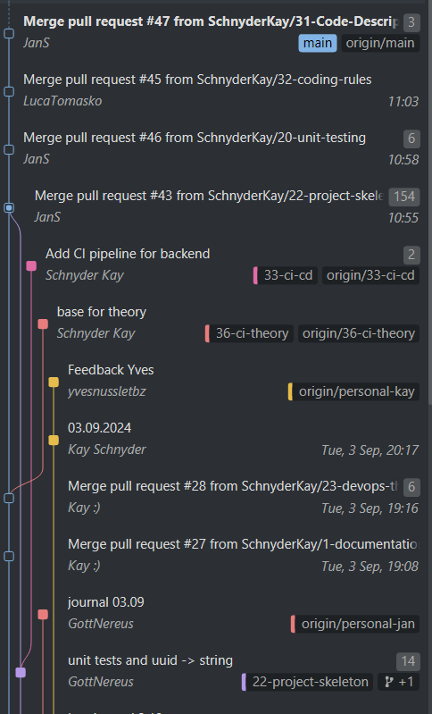

# Documentation

## PROJECT DEFINITION

Our application gives the user the opportunity to use a dropdown menu and choose an ingredient (ex. Gin, Vodka,Cola, Tonic). 
Based on the decision the application checks a database filled with cocktails and provides the user with all the possible cocktails with the chosen ingredient (ex. Gin Tonic, Vodka sour, Cuba Libre).
The Cocktails will be editable via CRUD (Create, Read, Update, Delete) endpoints.

## Branching

In our project, we adopted a branching strategy that enables parallel development while ensuring the main branch remains stable and ready for deployment. 

### Rules
Never push directly to the main branch. Always create a new feature branch from the main and create a pull-request to the main branch. The branch name starts with the ticket number-name and a short description of the task. Example: 1-documentation-add-definition

To contribute your work, create a new branch according to the branch naming rules. This branch can be used as a topic or feature branch. To merge the branch, create a pull-request and ask for a code review. The branches are deleted after accepting the merge request. Additionally, for the optional learn journal, please create a personal branch, which will be merged at the end of the project.

### Branching Flow:
- **Main Branch**: Holds production-ready code.
- **Develop Branch**: Used for integrating completed features before release.
- **Feature Branches**: Created for new features or bug fixes, named after the ticket (e.g., 36-CI/CD-Theory), linked to backlog tasks.
- **Personal Branches**: Each team member maintains a personal branch for their own notes or experiments, which isn't merged into the main codebase.
- There is no **release branch** currently since the project isn’t releasing code yet.


In this Image we show an example of how our Github Workflow & Commits are being pushed.

### Commit Rules:
- No commit limit, but messages must be clear and concise.
- Force-pushing allowed.
- Only commit on your own branches.

### Merge Criteria:
- All tests must pass and pipelines must succeed.
- No debug logs are permitted in pull-requests.
- Each pull-request must be reviewed and approved by at least one other coworker before merging.
- Delete branch after merging.

This strategy accelerates development, ensures independent work without disrupting the main codebase, and maintains a stable main branch.

## Meetings

The weekly will be every Tuesday at 8:30 o'clock.
At the meeting the team checks and updates the Kanban board and discusses the tasks in progress.
During the meeting, problems are discussed and open tasks are assigned to the members. 
The aim of the meeting is for everyone to know what they need to work on afterwards without having to request further feedback from anyone. 

Additionally a protocoll is written to ensure, that everyone on the team can look up their tasks and open discussion points.

## Enviroment

We will write our Frontend in Typescript React and our Backend in Java.
Every collaborator can use the IDE they prefer.

## Coding Rules

- Names of classes should be in camel case. 
- Names of variables and functions should be in lower camel case. 
- Names should be chosen with purpose behind them. 
- Code should be written with readability in mind. Readable code should be understood without having to ask somebody else for an explanation to achieve this the code has to be documented and the functions shouldn't have repeated code and should be kept as small as possible. 
- Logic and endpoints should be unit tested. 
- The application should be built on the REST principals.
- Have the SOLID priciples in your mind while coding.

## Database

### Manuel Setup

To setup the Docker container use the command given below
```
docker-compose -f ./DrinkDomain-main/docker-compose.yaml build
```

When the container is running you can start DBeaver and follow the instructions:

**Step 1**

🔴 Start by clicking the icon shown in the image.


**Step 2**

🔴 Insert "prostgres" in the password area.
🟢 coninue by clicking finish.


**Step 3**

🟢 Aftrer creating a connection, click on SQL in the navbar.


**Step 4**

Insert the SQL statement given 

[SQL file](DrinkDomain-main/backend/drinks_db.sql) 

🔴 Afterwards click the run script to create a table with data.


### Start Backend and DB

To start the backend, a terminal must be started in the IDE. 
In the terminal, navigate to the backend using ‘cd’ and execute the following command:

``` docker-compose up -d ```

## CI Pipeline

The Docker Build and Test CI Pipeline is set up to ensure the project builds successfully and passes all tests before deployment. It runs automatically on any branch push or pull request, except branches tagged with "personal."

### Pipeline Workflow

1. **Build and Test**:
   - Runs on an Ubuntu environment with JDK 18 set up (Corretto distribution).
   - Uses Gradle to build the project (skipping tests initially) and then runs tests to validate code functionality.
   - A test report is generated and uploaded as an artifact for easy review.

2. **Docker Image Creation**:
   - Pulls the necessary PostgreSQL image to include the database in the Docker environment.
   - Builds the Docker image using docker-compose, creating an environment that includes both the backend and the database.
   - Saves the completed Docker image as an artifact (`image.tar`) for potential deployment or further testing.

By the end of the pipeline, both the test report and Docker image are preserved as artifacts, providing a clear snapshot of the build and test state for each commit or pull request. This ensures a consistent, tested environment ready for the next deployment stage.

## Ticket System
Our ticketing system lets users create tickets directly through the frontend when they need help or have a request.
Each ticket, created under the DrinkDomainSupport account, appears in our Issues section and can be tagged as documentation, bug, or enhancement. 

Once a ticket is created, it’s reviewed and moved to the Kanban board for prioritization.
During Sprint planning, the team decides if it should go into the upcoming Sprint based on priority and resources.
Each ticket also receives an estimate for effort and a detailed description to ensure the assigned team member has all necessary context to start work smoothly.

This process keeps our workflow organized and efficient, making sure all tickets are ready to go with clear information and assigned priority before work begins.

## Time

Every collaborator must fill in his own time on the time sheet.
For every work time the collaborator must fill in the task they worked on and the required time.
The time must be entered to the nearest 15 minutes.

[Time Sheet](https://tbzedu-my.sharepoint.com/:x:/r/personal/kay_schnyder_edu_tbz_ch/_layouts/15/Doc.aspx?sourcedoc=%7B4C0BDA20-4AE3-4985-A780-3F4F67B43329%7D&file=time_logger%201.xlsx&action=default&mobileredirect=true&wdOrigin=TEAMS-WEB.p2p_ns.rwc&wdExp=TEAMS-TREATMENT&wdhostclicktime=1724143689247&web=1)


## User Stories
The user stories are used to imitate the behavior of a user. 
We can use these stories to build tests and logic into our application.
This simplifies the planning and creation of tickets.


## Classification figures

We use two different kinds of classification figures, which are used in the business report. For the first we used all metrics from our tickets, which gives us different information about our work process. All the information about the tickets can be found [here](https://tbzedu-my.sharepoint.com/:x:/g/personal/kay_schnyder_edu_tbz_ch/ETEOqXSWJ_NElX9zm-97S48BYXe6KywImw80YmzvvCs97Q?e=njes6M).

## Protocol

### 27.08.2024

**Past Tasks**

For today, **Luca** finished the three-way theory, and **Aryan** finished the CALMS theory. Both of these inputs will be explained at 10 o'clock for the whole group. The script to create and fill the database should be finished as well and will be tested later in the day. 

**Next Task**

As a group, we will now revise our Kanban board and create the new necessary tickets for the next few weeks. In addition to new tasks, we need to distribute story points for each issue, where the rule is that 30 minutes is equal to 1 story point. 

We decided to use a Java backend and a React frontend for our application. 

The next tasks will be distributed as follows:

**Jan** and **Aryan** will create the base of the project, and if they have leftover time, they will start coding. 

**Kay** starts the theory for the DevOps processes. 

**Jan** and **Kay** start setting up the database, and **Jan** writes the necessary documentation for the setup.

**Luca** should write down the coding rules that our team will follow.

### 03.09.2024

**Next Task**

As of today, we as a group will add the descriptions to the Kanban board and fix our time sheet. We also need to push our learning journals and add our teacher as a collaborator. 

For the rest of the day, **Aryan** and **Jan** will work on the backend and the unit tests, as well as the needed user stories. 

**Kay** works on finishing the DevOps theory and helps the other two as soon as she's finished.

### 10.09.2024

**Next Task**

In todays meeting we discussed that we should start writing tickets regarding the feedback we get from our teacher and implement it. In future we will continue to create tickets based on the feedback we get from our teacher. We also discussed that we should make sure that the project runs on everyone's device.
 
**Luca** should check the criteria for the unit tests and write the protocol for the documentation.

**Kay** and **Jan** will take a look at the user stories **Aryan** wrote last week and will also work on the backend so everything that is due today is done.

The theory part on continues integration will be done by **Aryan**.

### 17.09.2024

**Next Task**

Feedback:

The overall feedback was positive.
We will work on improving the infomations and tips given in the feedback.

**Jan:**

DB in Dockerfile: 
Jan is working alongside Jan to complete the database setup in the Dockerfile.
Integration Tests: 
Jan is also working on implementing integration tests. These tests should be executed to validate the interactions between different components of the system.
Integration Tests in Pipeline: He will integrate the automated execution of the tests within the CI pipeline, ensuring that they are run during each build to catch issues early.
Application Version 2 (Optional): Kay and Jan may also begin work on a second version of the application, depending on the progress of the pipeline setup.

**Aryan:**

Branching Strategy: 
Aryan is responsible for setting up and documenting the branching strategy. 
This includes defining how features, bug fixes, and releases will be managed within version control to maintain a clean and organized codebase.
CD Theory: 
Aryan also provided an overview of Continuous Deployment (CD) principles, highlighting the theoretical concepts that the team should follow in practice.

**Luca:**

Setting up CD: 
Luca is tasked with researching and setting up the Continuous Deployment process. 
He will focus on automating deployments and ensure that updates can be reliably and quickly delivered to the production environment.
Researching Information: 
Luca will also gather relevant information and resources to help or even start implement the CD process effectively.

**Kay:**

DB in Dockerfile: 
Kay was responsible for ensuring the database setup is included in the Dockerfile. The task involved setting up the database so that it is consistently available within the Docker environment.
Completing the Pipeline: 
Kay’s primary responsibility is finishing the CI pipeline setup, ensuring that all components (testing, building, deployment) are functioning correctly and efficiently.
Application Version 2 (Optional): Kay and Jan may also begin work on a second version of the application, depending on the progress of the pipeline setup.

### 24.09.2024

During the meeting, we discussed the feedback received, which was very positive overall. 
We were able to make improvements on a few specific points that had been highlighted like the docker file.

**Jan:**

Jan provided an update on his work regarding the frontend. 
He is currently focusing on updating the frontend and working specifically on the dropdown implementation.

**Kay:**

Kay is responsible for adjusting the Docker Compose configuration according to the feedback. 
She also mentioned that if she completes her task early, she will assist Luca with her work.

**Aryan:**

Aryan is focusing on expanding the branching strategy. 
His goal is to improve the workflow by optimizing how branches are managed during development.

**Luca:**

Luca’s main task is to develop the Continuous Deployment (CD) pipeline. 

In addition to the updates, a couple of questions were discussed. The first one was related to testing during the merge process, as there was some confusion about why testing is performed at this stage. The second point concerned the division and structure of the Docker environment, specifically how Docker is segmented.

### 01.10.2024

During the meeting, we created a list of open tasks and assigned responsibilities accordingly. 
Below is the overview of the tasks each team member is currently working on.

**Open Tasks:**

- Complete the Continuous Deployment (CD) pipeline.
- Develop a system to monitor key performance indicators with a logger (KPI's).
- Create a ticket system for Continuous Improvement initiatives.
- Write the protocol.
- Prepare the business report.
- 
**Questions Discussed:**
  
Are the current KPIs acceptable (e.g., how many requests per minute, logger implementation)?
Additional points raised by **Kay** about increasing the pipeline and deployment scope.
Discussion about implementing a ticket system for handling customer tickets.

**Aryan:**

Aryan is working on expanding the branching strategy and setting up a logger system to monitor key metrics. 
This is crucial for ensuring that we can track the system's performance effectively.

**Jan:**

Jan is tasked with fixing the frontend and writing the protocol. 
However, during the discussion, it was decided that the previous frontend approach will be discarded due to a shift in the overall strategy.

**Kay:**

Kay is responsible for writing the business report and setting up the ticket system to handle customer issues. 
Her focus is on ensuring that the ticketing process is streamlined for better customer support.

**Luca:**

Luca is developing the Continuous Deployment (CD) pipeline for AWS, utilizing micro cubes architecture to improve scalability and efficiency in deployments.

### 22.10.2024

In the current meeting, we reviewed the status of the outstanding tasks and set priorities for the project. 
The most urgent task is completing the CD pipeline to streamline the development process. 
Another key focus is implementing a system to monitor key performance metrics, which will help track the project's progress. 
Two important documents also remain to be written: the meeting protocol and the business report, the latter of which depends on the finalized metrics.

Individual Tasks:

**Jan:**

Jan is responsible for writing the meeting protocol to document the progress of the project. 
In addition, he will set up Aryan's project to help him get started. 
He is also tasked with investigating various options for the CD pipeline to determine the best solution for the team. 
Lastly, Jan will compare the estimated time against the actual time taken for tasks, which will help improve time management moving forward.

**Kay:** 

Kay will assist Jan in exploring options for the CD pipeline, contributing to the analysis and decision-making process. 
She is also responsible for documenting the ticketing system, which is essential for collecting 
the necessary key performance metrics. Additionally, Kay will compare the estimated times with the real times to assess and improve the team's efficiency.

**Aryan:**

Aryan's main focus is completing the logger for tracking key performance metrics, which is crucial for monitoring and analyzing project data. 
If the logger isn't finished on time, Aryan will continue working on it until it's fully implemented. 
This task is vital for enabling accurate control of project metrics.

**Luca:**

Luca will continue working on expanding the CD pipeline, with support from Mr. Nussle. 
He will focus on developing and adjusting the pipeline to ensure it meets the project's requirements and runs smoothly.

### 29.10.2024

In today’s meeting, we reviewed the key tasks each team member will focus on to progress with project documentation and completion of the CI/CD pipeline. Specific tasks include finalizing technical implementations, reviewing, and updating documentation, as well as preparing the business report once data from the logger becomes available.
 
Individual Tasks:
 
**Luca:**
 
Luca is responsible for completing and documenting the CI/CD pipeline. 
This will involve final adjustments and ensuring all processes are well-documented for future reference.
 
**Aryan:**
 
Aryan will finalize the timelogger and complete its documentation. 
Additionally, he will revise the section of the documentation detailing the project setup, ensuring it is clear and accurate.
 
**Jan:**
 
Jan is tasked with writing the meeting protocol to ensure project progress is thoroughly documented. 
He will also review the current documentation, making any necessary updates or improvements.
 
**Kay:**
 
Kay will also review and, if necessary, update the documentation to ensure clarity and completeness. 
If Aryan completes the logger today, Kay will begin drafting the business report and linking it in the documentation for comprehensive project reporting.

### 05.11.2024

In today’s meeting, we clarified the remaining tasks needed to complete the logger, finalize the CI/CD pipeline, and prepare the business report.
Each team member has been assigned theyr own responsibilities focused on completing these tasks and upload them into the documentation.

Individual Tasks:

**Aryan:**

Aryan’s main task is to complete the logger, ensuring it functions as required and finalizing its documentation.

**Luca:**

Luca is responsible for finalizing the CI/CD pipeline. 
Once this task is complete, he will assist Aryan if additional support is needed to complete the task.

**Jan:**

Jan will write today’s meeting protocol, ensuring all project actions are documented.
Additionally, he will update the project’s key metrics. 
Once these updates are complete, he will collaborate with Kay to write the business report.

**Kay:** 

Kay’s tasks include uploading the Docker image to Docker Hub for distribution.
After updating the key metrics, she will work with Jan to write the business reporta. 
Additionally, she will update all diagrams in the documentation with the new metrics.
