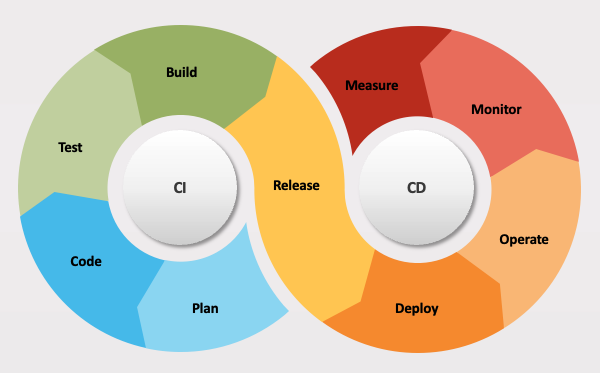
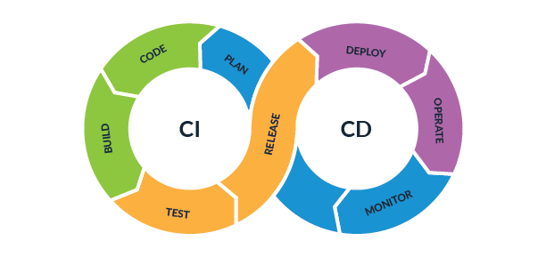
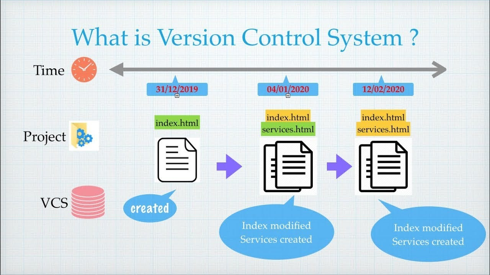
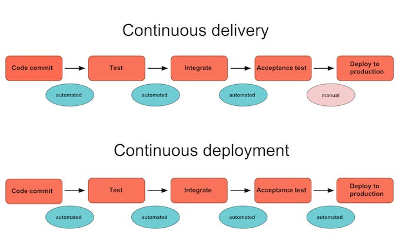
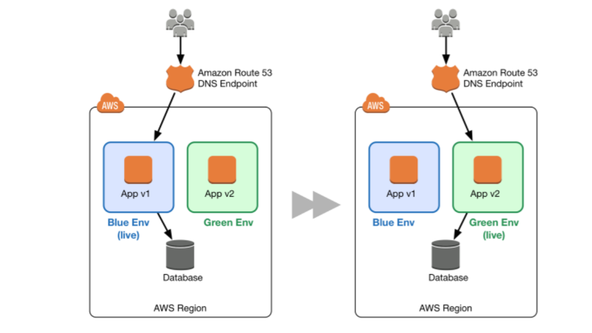
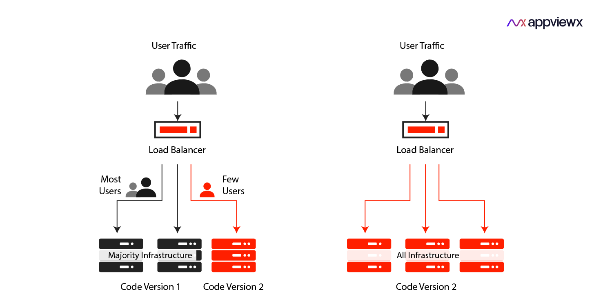
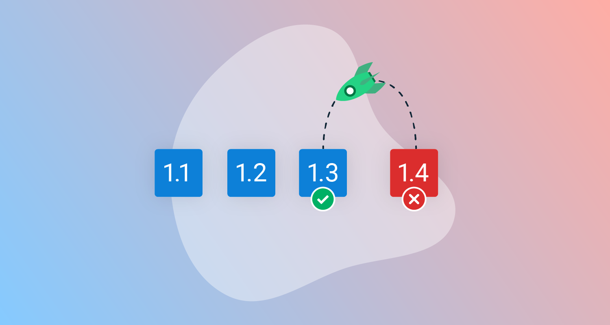
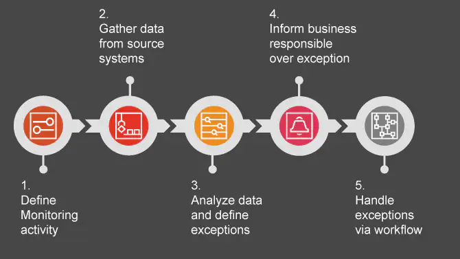

# CD

### 1. What is Continuous Deployment and how is it implemented?

## Introduction to Continuous Deployment

**Continuous Deployment (CD)** is a software development practice where code changes are automatically deployed to production environments after they pass through a series of automated tests. Unlike traditional deployment methods, where manual approval is needed for the release of new features, continuous deployment aims to automate the entire release process, ensuring that changes reach the end-users quickly and efficiently. Continuous deployment is one of the key practices in the DevOps culture and represents a significant shift in how modern software is delivered.

In a continuous deployment workflow, every code change that passes automated testing is automatically deployed to the production environment, without manual intervention. This enables development teams to deliver features, improvements, and bug fixes at a much higher pace, while maintaining stability and quality.

This image represents how some IT-Company see how Continous deployment should work.

## Key Concepts of Continuous Deployment

### 1. **Automated Testing**
Automated testing plays a crucial role in continuous deployment. Before any code can be deployed to production, it must pass a set of automated tests that verify its correctness and functionality. There are various types of tests used in this process, including:

- **Unit Tests**: These test individual components or units of the code for expected behavior.
- **Integration Tests**: These ensure that different modules or services of the application work together as expected.
- **End-to-End Tests**: These simulate user interactions and check if the system behaves as intended from start to finish.

These automated tests provide confidence that changes to the code won’t introduce regressions or bugs in the production environment.

### 2. **CI/CD Pipelines**
A **CI/CD pipeline** is a sequence of automated steps that build, test, and deploy code changes. In continuous deployment, this pipeline plays a critical role, as it ensures that every step of the process — from code integration to final deployment — happens smoothly and without human intervention. A typical pipeline includes:

- **Code Integration**: The moment new code is merged into the main branch, the pipeline kicks in.
- **Automated Build**: The system automatically compiles the code and prepares it for testing.
- **Automated Testing**: The new code is subjected to automated tests.
- **Automated Deployment**: Once the tests pass, the code is automatically deployed to production.

### 3. **Version Control Systems**
Continuous deployment is built on top of version control systems (VCS) like **Git**. Developers work on new features or bug fixes in separate branches. Once a feature is ready, it is merged into the main branch. Each merge triggers the pipeline, and if the code passes all the necessary tests, it gets deployed.

Version control ensures that there is a history of every change made to the codebase, which is crucial for tracking issues and rolling back problematic changes.

### 4. **Monitoring and Alerts**
Since changes are deployed continuously, it is vital to monitor the production environment for any issues. Continuous deployment systems are usually paired with real-time monitoring tools that track performance, errors, and other key metrics. If something goes wrong, alerts are triggered, and the team can respond quickly.

Monitoring tools can detect:

- **Performance drops**: Slower response times or increased server load.
- **Errors**: Unexpected exceptions or failures in the system.
- **Security threats**: Unusual or unauthorized access patterns.

---

## Benefits of Continuous Deployment

### 1. **Faster Time-to-Market**
Continuous deployment allows companies to deliver new features, bug fixes, and improvements much faster. Since every successful commit goes directly to production, users can benefit from the latest updates almost immediately.

### 2. **Higher Quality through Frequent Releases**
Instead of bundling many changes into a large release, continuous deployment promotes small, frequent updates. This reduces the risk of introducing bugs, as each change is smaller and easier to understand. Additionally, with automated tests in place, the quality of the code is constantly checked before it reaches the end user.

### 3. **Improved Developer Productivity**
By automating the release process, developers can focus more on coding and less on deployment logistics. The need for manual intervention is reduced, freeing up developers to work on other important tasks like writing new features or improving the system.

### 4. **Reduced Deployment Stress**
With continuous deployment, releases become a non-event. Instead of scheduling a big release at the end of a sprint, where potential issues are high, continuous deployment ensures that small changes are delivered consistently. This reduces the anxiety often associated with large deployments.

---

## Challenges of Continuous Deployment

### 1. **Maintaining Test Coverage**
For continuous deployment to be effective, automated tests must cover a wide range of scenarios. Inadequate test coverage can lead to bugs slipping through to production. Maintaining and updating these tests is a significant investment and requires discipline from the development team.

### 2. **Handling Failures in Production**
While continuous deployment emphasizes automated testing, it cannot predict every possible issue that may arise in production. To mitigate risks, teams often need to have robust **rollback** strategies in place. If a deployment causes problems, it should be easy to revert to a previous stable version.

### 3. **Security Concerns**
As code is deployed frequently and automatically, the risk of security vulnerabilities slipping through also increases. This makes it essential to have security checks and audits integrated into the deployment pipeline. Additionally, ensuring that no sensitive information is exposed in production requires careful management of configuration settings and secrets.

---

## Implementing Continuous Deployment

### 1. **Start with Continuous Integration**
Continuous deployment builds on the foundation of **Continuous Integration (CI)**, where developers frequently merge their changes into the main branch. By ensuring that the codebase is always in a deployable state, teams can confidently implement automated deployments.

### 2. **Automate Testing and Deployment**
To implement continuous deployment, all steps of the deployment process must be automated. This includes not just building and testing the code, but also deploying it to production environments. Tools like **Jenkins**, **CircleCI**, **GitLab CI**, and **GitHub Actions** are commonly used for this purpose.

### 3. **Deploy Gradually (Canary or Blue/Green Deployments)**
To reduce the risk of deploying faulty code, gradual deployment strategies like **Canary Deployments** or **Blue/Green Deployments** can be employed. These strategies ensure that the code is tested in a live environment with a subset of users before being rolled out to everyone.

### 4. **Implement Robust Monitoring**
Once continuous deployment is in place, having real-time monitoring and alerting tools is critical. Monitoring tools like **Prometheus**, **Grafana**, or **New Relic** provide insights into the health of the application in production and help detect issues early.

### 5. **Incorporate Rollback Mechanisms**
Continuous deployment should also include mechanisms for quickly rolling back changes if something goes wrong in production. This could involve reverting to the previous version of the code or disabling certain features temporarily.

## How We Implemented Continuous Deployment

Our implementation of Continuous Deployment was achieved using **ArgoCD** and **Kubernetes**, two powerful tools that streamline the process of deploying applications in a cloud-native environment.

### 1. **ArgoCD for GitOps-Based Continuous Deployment**

We utilized **ArgoCD**, a declarative, GitOps-based continuous deployment tool, to manage our Kubernetes resources. ArgoCD allows us to define the desired state of our application in a Git repository. This includes all Kubernetes manifests, configurations, and policies.

- **Git as the Source of Truth**: ArgoCD continuously monitors the Git repository where we store our Kubernetes manifests. Any changes committed to the repository (such as new features, updates, or bug fixes) automatically trigger a deployment.
- **Declarative Management**: By defining our desired state declaratively, we ensure that our production environment always mirrors the state described in Git. ArgoCD automatically synchronizes the actual state of the cluster with the desired state, deploying new versions or rolling back changes if necessary.
- **Automated Syncing**: When a developer pushes changes to the Git repository, ArgoCD automatically syncs the updates with the Kubernetes cluster. This means that every successful code commit that passes the CI pipeline is immediately reflected in production, without manual intervention.

### 2. **Kubernetes for Orchestration**

Our deployment architecture runs on **Kubernetes**, which serves as the orchestration platform for managing containerized applications. Kubernetes provides scalability, resilience, and automated deployment management.

- **Automated Rollouts and Rollbacks**: Kubernetes automatically rolls out new container images with updated code. If a deployment fails (e.g., due to unhealthy pods or configuration issues), Kubernetes can rollback to the previous stable version, ensuring minimal downtime.
- **Scaling and Load Balancing**: We take advantage of Kubernetes’ built-in scaling features to handle increased traffic automatically. Kubernetes adjusts the number of running instances (pods) based on resource usage and traffic patterns, ensuring our services remain performant during high load periods.
- **Health Monitoring and Self-Healing**: Kubernetes constantly monitors the health of our applications. If a pod becomes unresponsive or crashes, Kubernetes automatically restarts or replaces it, ensuring high availability.

### 3. **Continuous Monitoring and Observability**

Alongside ArgoCD and Kubernetes, we integrated monitoring tools such as **Prometheus** and **Grafana** to continuously observe the state of our deployments. These tools provide real-time metrics and alerting, enabling us to quickly detect and respond to any issues in production.

By using **ArgoCD** for GitOps-driven deployments and **Kubernetes** for orchestration, we created a fully automated, scalable, and resilient continuous deployment pipeline. This approach ensures that new code changes are deployed rapidly, with minimal risk, while maintaining high availability and stability in our production environment.

---

## Conclusion

Continuous deployment is a powerful approach to modern software development that enables teams to deliver changes rapidly and reliably. While it comes with its challenges, such as maintaining test coverage and ensuring security, the benefits of faster time-to-market, improved quality, and reduced deployment stress make it a valuable practice for any organization looking to adopt DevOps principles. By automating the deployment process, teams can focus on innovation, ensuring that their software is always up-to-date and ready for their users.

### 2. What is the difference between Continuous Deployment and Continuous Delivery?

**Continuous Deployment (CD)** and **Continuous Delivery** are key practices within the DevOps ecosystem, aimed at automating and streamlining the process of releasing code changes. However, they differ significantly in how they approach the final step of deployment to production.

---

## 1. **Continuous Delivery**

**Continuous Delivery** is the practice where code changes are automatically built, tested, and staged for a production release, but the final deployment to production is a manual decision. Continuous Delivery ensures that the codebase is always in a deployable state, meaning every change is ready to be pushed to production, but it is not automatically released.

### Key Aspects of Continuous Delivery

#### a. **Automated Pipelines**
Continuous Delivery leverages automated pipelines where code goes through various stages of testing (unit tests, integration tests, etc.) and is prepared for release. All code changes are verified via these automated processes to ensure they meet the desired quality before moving to production.

#### b. **Manual Gate for Production**
The primary distinction in Continuous Delivery is the introduction of a **manual gate** before the deployment happens. After the code has passed all automated tests, a human needs to approve or schedule the release to the production environment. This manual step often involves:

- **Business or Legal Approval**: In industries with strict compliance (e.g., healthcare, finance), certain regulatory approvals or business decisions may be required before releasing features.
- **Risk Management**: Teams may prefer to wait for the right timing to release, based on market readiness, user feedback, or peak traffic times.

#### c. **Always Deployable**
Continuous Delivery emphasizes keeping the codebase in a **deployable state** at all times. This means that although deployment is manual, the code is always production-ready after passing tests.

#### d. **Increased Confidence**
Since Continuous Delivery requires passing multiple stages of automated testing before release, teams can have high confidence in the quality and reliability of the software. The final manual approval step serves as a safety net to verify that the release aligns with business goals or regulatory requirements.

### Benefits of Continuous Delivery

- **Control over Deployment Timing**: The ability to manually choose when to deploy provides flexibility in scheduling releases, reducing the risk of introducing issues during critical periods.
- **Human Oversight**: Ensuring that someone manually verifies and approves changes before they reach production provides an extra layer of security, which is useful in environments with legal or compliance constraints.
- **Reduced Downtime and Risk**: By staging releases carefully, organizations can mitigate potential risks by deploying at optimal times.

---

## 2. **Continuous Deployment**

**Continuous Deployment** automates the entire software release process. It goes beyond Continuous Delivery by removing the manual approval step, ensuring that every code change that successfully passes through the testing pipeline is automatically deployed to production. In this model, the deployment process is completely hands-off, meaning that updates reach end-users almost immediately after being committed.

### Key Aspects of Continuous Deployment

#### a. **Fully Automated Deployment**
In Continuous Deployment, every code commit that passes automated tests (unit, integration, and end-to-end tests) is automatically released to production. There is no manual intervention between the developer committing the code and the code being live for users.

- **CI/CD Pipelines**: Continuous Deployment relies on sophisticated CI/CD pipelines that not only test the code but also automate the deployment to the production environment.
- **Zero Human Intervention**: There are no manual gates or approval steps. The entire process, from code push to production deployment, is automated.

#### b. **Fast Feedback Loops**
Since code is deployed immediately after passing the tests, developers get **real-time feedback** on the impact of their changes in production. If an issue arises, it is detected and fixed quickly, minimizing downtime.

#### c. **Robust Automated Testing**
To ensure that faulty code doesn’t make it to production, Continuous Deployment requires **extensive test coverage**. Automated testing needs to be thorough, covering unit tests, integration tests, and end-to-end tests to verify that the code is stable, secure, and performs as expected in various environments.

#### d. **Monitoring and Rollbacks**
Continuous Deployment also requires strong **monitoring** and **rollback mechanisms**. Since code is deployed continuously, real-time monitoring tools (such as Prometheus or Grafana) track the system’s health and alert the team to any issues. If a problem is detected, the system should automatically roll back to a stable state or apply fixes quickly.

### Benefits of Continuous Deployment

- **Faster Time-to-Market**: Features, bug fixes, and improvements are deployed as soon as they are ready, providing value to users immediately. This reduces the lead time between development and production.
- **Reduced Risk through Smaller Changes**: Frequent small deployments mean fewer changes are introduced at once, making it easier to identify and fix issues.
- **Increased Productivity**: Developers focus solely on coding, with the assurance that their changes will be tested and deployed automatically, without the need for additional manual steps.

---

## 3. **Key Differences Between Continuous Delivery and Continuous Deployment**

| Feature                     | Continuous Delivery                                        | Continuous Deployment                                          |
|-----------------------------|------------------------------------------------------------|----------------------------------------------------------------|
| **Deployment Process**       | Code changes are tested and staged for manual release.     | Code changes are tested and automatically deployed to production. |
| **Manual Approval**          | Requires manual approval or review before deployment.      | No manual approval; deployment is fully automated.              |
| **Release Frequency**        | Release happens at the team’s discretion, often based on business or regulatory needs. | Every change that passes tests is immediately released to production. |
| **Risk Management**          | Allows for more deliberate consideration of risk and timing. | Requires comprehensive automated testing and monitoring to minimize risk. |
| **Automation Level**         | High level of automation, but with a manual release step.  | Fully automated, from code commit to production deployment.     |

---

## 4. **Which Approach to Choose?**

Choosing between Continuous Delivery and Continuous Deployment depends on the organization’s goals, risk tolerance, and industry:

- **Continuous Delivery** is ideal for organizations that need human oversight, such as those operating in regulated industries where code changes must be reviewed before release. It provides flexibility in deciding when to deploy, balancing speed with control.

- **Continuous Deployment** is suited for teams that want to deploy new changes as quickly as possible. It’s often preferred by tech companies or SaaS providers who deploy small updates frequently and want to minimize manual intervention.

Both approaches are built on the foundations of automation and reliability but cater to different organizational needs. Continuous Deployment optimizes for speed and immediate user feedback, while Continuous Delivery offers more control and the ability to carefully schedule releases.

### 3. What are the advantages and disadvantages of Continuous Delivery and Continuous Deployment?

#### Continuous Delivery

| Aspect                        | Advantages                                                                                                     | Disadvantages                                                                                                  |
|-------------------------------|---------------------------------------------------------------------------------------------------------------|---------------------------------------------------------------------------------------------------------------|
| **Control Over Release Timing**| Provides flexibility to release when the business is ready, aligning releases with marketing or strategic plans. | Manual approval slows down deployment speed, delaying the release of new features and updates.                 |
| **Risk Management**            | Allows for manual review, reducing the risk of introducing critical bugs into production.                      | Requires manual intervention for each release, increasing workload for development and operations teams.        |
| **Compliance and Regulation**  | Ideal for industries requiring manual approvals to meet regulatory needs and compliance.                       | Slower feedback loops, as changes are only deployed after manual approval, delaying user feedback and iterations.|
| **Human Oversight**            | Ensures a final human review to verify the release aligns with business goals and compliance requirements.      | Introduces bottlenecks, especially in fast-moving environments where frequent releases are required.            |
| **Business Alignment**         | Releases can be timed with business and marketing strategies, offering more control over the deployment process.| Urgent bug fixes or updates can be delayed due to the manual approval process.                                  |

#### Continuous Deployment

| Aspect                        | Advantages                                                                                                     | Disadvantages                                                                                                  |
|-------------------------------|---------------------------------------------------------------------------------------------------------------|---------------------------------------------------------------------------------------------------------------|
| **Faster Time-to-Market**      | New features and bug fixes are deployed immediately after testing, reducing time-to-market.                     | Automated deployment can introduce issues into production without human review, relying entirely on automated tests. |
| **Reduced Risk**               | Frequent, smaller changes lower the risk of major disruptions, making it easier to pinpoint and fix problems.   | Requires comprehensive automated testing; insufficient test coverage could result in faulty code being deployed. |
| **Immediate Feedback**         | Users receive new updates instantly, providing faster feedback and enabling quicker iterations.                 | Teams must handle real-time incidents, increasing the pressure to detect and respond to production issues quickly. |
| **Higher Developer Productivity**| Developers can focus on writing code, knowing that the deployment process is fully automated.                   | Teams must have strong monitoring and rollback systems in place to handle live failures effectively.            |
| **Business Responsiveness**    | Enables real-time responses to business needs, market opportunities, or user feedback.                          | Over-reliance on automation may overlook important business or compliance considerations requiring human judgment.|
| **Operational Complexity**     | Automation of deployments reduces manual operational overhead, freeing up resources for other tasks.           | Setting up automated testing, monitoring, and rollback strategies can be complex and resource-intensive initially. |

Here’s a detailed explanation of deployment strategies and how they are implemented:

---

### **What are the following deployment strategies and how are they implemented?**

When releasing new features, updates, or fixes, different deployment strategies can be used to ensure minimal disruption, high availability, and lower risk of issues. These strategies offer various ways to manage how and when code is rolled out to users. Below, we’ll explore some key deployment strategies: **Blue/Green Deployment**, **Canary Deployment**, and **A/B Testing**.

---

#### **1. Blue/Green Deployment**

**Definition**:  
Blue/Green Deployment is a strategy that involves maintaining two identical production environments: one is the active (live) environment (the "Blue" environment), while the other is a staging or idle environment (the "Green" environment). When a new version of the application is ready to be deployed, it is deployed to the idle (Green) environment first. Once all testing is completed and the new version is deemed stable, traffic is switched over from the Blue environment to the Green environment.

**How It Works**:
- **Two Environments**: The deployment consists of two environments running simultaneously — one active and one idle. At any point, only one environment serves the live traffic.
- **Deployment Process**:
  1. The current version of the application runs on the **Blue environment** (live).
  2. The new version is deployed to the **Green environment** (staging), which mirrors the live environment but does not serve any production traffic.
  3. Once the new version passes automated tests, integration checks, and any manual verification, the load balancer switches traffic from Blue to Green.
  4. The Green environment becomes the live (production) environment, while Blue is now idle.
- **Rollback**: If an issue is detected after switching, rolling back is straightforward — traffic can simply be switched back to the original (Blue) environment.
  
**Advantages**:
- **Minimal Downtime**: The switch between Blue and Green is almost instantaneous, leading to negligible downtime.
- **Easy Rollback**: In case of failure, it’s easy to revert by redirecting traffic back to the previous environment.
- **Isolation of Environments**: Since the new deployment is done in isolation, issues in the Green environment do not affect the current live traffic.

**Disadvantages**:
- **Double Resource Usage**: Running two environments in parallel (even if one is idle) requires double the resources, which can be expensive.
- **Synchronization Complexity**: Databases and other shared resources need to be carefully synchronized across environments, adding complexity.

**Example of Implementation**:  
In cloud platforms like **AWS**, Blue/Green deployment can be implemented using services like **Elastic Beanstalk**, **AWS CodeDeploy**, and **Route 53** for traffic management. Traffic is seamlessly redirected from the Blue environment to the Green environment after deployment. Similarly, Kubernetes also supports Blue/Green deployments with services and load balancers handling the traffic switching.

---

#### **2. Canary Deployment**

**Definition**:  
Canary Deployment is a strategy where a new version of the application is released to a small subset of users before gradually rolling it out to the entire user base. This is done to test the stability and performance of the new version in a real-world environment while minimizing risk.

**How It Works**:
- **Gradual Rollout**: Instead of deploying the new version to the entire user base, the update is initially rolled out to a small percentage of users, often called "Canary users." Based on the feedback and performance, the deployment is gradually increased to a larger set of users.
- **Deployment Process**:
  1. Deploy the new version to a small portion of users (e.g., 5-10% of traffic) while keeping the majority of users on the old version.
  2. Monitor the performance and error rates from the Canary users. If everything works as expected, gradually increase the percentage of users who receive the new version.
  3. Continue monitoring at each step until the new version is fully deployed to all users.
- **Rollback**: If issues are detected, the deployment can be paused, and affected users can be rolled back to the old version, minimizing the impact of the failure.

**Advantages**:
- **Lower Risk**: Canary deployments reduce the risk of widespread issues, as only a small portion of users is affected initially.
- **Real-World Testing**: The new version is tested in a live environment with real users, providing valuable insights into its performance and potential issues.
- **Quick Rollback**: If something goes wrong, it is easier to revert for the small set of affected users, minimizing overall damage.

**Disadvantages**:
- **Complexity in Management**: Managing multiple versions simultaneously (old and new) can add complexity to infrastructure and deployment pipelines.
- **Inequitable User Experience**: Early adopters may experience issues that other users don’t, leading to inconsistencies in user experience.

**Example of Implementation**:  
Kubernetes is well-suited for Canary deployments. Tools like **Istio** or **NGINX Ingress** can be used to direct a specific percentage of traffic to the new version, gradually ramping up as confidence in the deployment grows. Canary deployments can also be managed through cloud platforms like **Google Kubernetes Engine (GKE)** or **AWS ECS**, combined with **AWS Application Load Balancer** for traffic management.

---

#### **3. A/B Testing**

**Definition**:  
A/B Testing is primarily a strategy used to test different versions of a feature or application with users in real time to determine which version performs better based on user interaction. It’s typically more of a product optimization strategy than a deployment strategy but is closely related when releasing new features.

**How It Works**:
- **Split Traffic**: The user base is split into two (or more) groups, with each group receiving a different version (A or B) of the application or feature.
- **Data-Driven Testing**: The versions are compared by measuring key metrics, such as user engagement, conversion rates, or performance. These metrics help decide which version provides a better experience.
- **Deployment Process**:
  1. Create two versions of the feature (A and B).
  2. Deploy both versions to different subsets of users.
  3. Monitor user interactions and collect data on predefined success criteria.
  4. Based on the analysis, the version with better performance is selected, and the losing version is phased out.
- **No Rollback**: Unlike other deployment strategies, the goal isn’t rollback but choosing the winning version for full deployment.

**Advantages**:
- **Data-Driven Decisions**: A/B Testing allows decisions to be made based on actual user data, leading to better user experience and improved product features.
- **Optimization of Features**: Developers can experiment with different designs, workflows, or features and determine which variation yields the best results.

**Disadvantages**:
- **Limited Scope**: A/B Testing focuses more on product optimization than deployment, so it may not apply to every type of update or release.
- **Increased Complexity**: Running two (or more) versions in parallel adds complexity in terms of tracking and infrastructure.

**Example of Implementation**:  
A/B testing can be done using platforms like **Google Optimize** or **Optimizely**, where developers can run tests and gather insights on which version performs better. It is also possible to implement this in-house by using feature flags to control which users get which version of the application.

---

#### **4. Feature Toggles (Feature Flags)**

**Definition**:  
Feature Toggles (or Feature Flags) are a technique in which specific features can be turned on or off in production without deploying new code. This allows developers to release code to production without making it available to all users.

**How It Works**:
- **Toggle-Based Activation**: Features are wrapped in conditional logic that checks whether the feature toggle is enabled for a specific user or environment.
- **Deployment Process**:
  1. Deploy the new code with the feature disabled by default.
  2. Gradually enable the feature for specific users, regions, or environments by flipping the toggle.
  3. If there are issues, the feature can be turned off without requiring a new deployment.
  
**Advantages**:
- **Controlled Rollouts**: New features can be deployed without being visible to all users, enabling gradual rollouts.
- **Quick Rollbacks**: Features can be disabled instantly if something goes wrong, without needing to roll back the entire deployment.
- **A/B Testing Enablement**: Feature toggles can be used to enable A/B Testing, allowing different user groups to experience different versions.

**Disadvantages**:
- **Increased Complexity**: Managing feature flags can add complexity to the codebase and deployment pipeline, especially when multiple flags are used.
- **Technical Debt**: If not managed properly, feature flags can become technical debt when old flags are not removed after they are no longer needed.

**Example of Implementation**:  
Popular tools like **LaunchDarkly**, **Feature Toggle** in **GitLab**, and **Unleash** offer robust platforms for managing feature toggles in production environments. Additionally, feature toggles can be implemented in-house using simple logic in code.

---

#### **5. Rollback Strategies**

**Definition**:  
A Rollback Strategy is a plan for reverting a system or application to a previous stable version when an issue is detected after deployment. It’s essential for maintaining uptime and minimizing the impact of issues on users.

**How It Works**:
- **Version Control**: The system keeps track of previous versions of the application. When an issue is detected, the system or operations team can roll back to the last known good version.
- **Rollback Process**:
  1. Detect a failure or issue in the

 current deployment.
  2. Initiate a rollback to the previous version of the application or environment.
  3. Monitor the rollback to ensure the system is restored to a stable state.

**Example of Implementation**:  
Kubernetes offers built-in rollback features with **kubectl rollout undo**, making it easy to revert to a previous deployment. Tools like **GitLab CI/CD** or **Jenkins** can also automate rollback in the event of a failed deployment.

---

#### **6. Continuous Monitoring**

**Definition**:  
Continuous Monitoring is the practice of constantly tracking the performance, stability, and health of the application in production. It ensures that any issues are detected as soon as they arise.

Audit & Assurance Platform for monitoring.

**How It Works**:
- **Automated Tools**: Monitoring tools track various metrics such as uptime, response times, error rates, and server load. Alerts are triggered if any of these metrics fall outside predefined thresholds.
- **Monitoring Process**:
  1. Integrate monitoring tools such as **Prometheus**, **Grafana**, or **Datadog** to track the health of the system.
  2. Set up dashboards and alerts for real-time visibility and notifications of any anomalies.
  3. Use automated monitoring to continuously assess the application, especially after deployments.

**Example of Implementation**:  
In a Kubernetes environment, tools like **Prometheus** can monitor cluster health and application performance, while **Grafana** provides dashboards for real-time data visualization.

---

These deployment strategies provide various ways to manage risk, improve deployment speed, and ensure stability in modern software delivery. Each has its unique use cases, and choosing the right strategy depends on the goals of the deployment and the resources available for implementation.

### 9. How are passwords securely stored?

Passwords are securely stored using a process called **hashing**. Hashing converts the password into a fixed-length string of characters, often called a hash value, which cannot be easily reversed to the original password. Here’s a secure approach to storing passwords:

1. **Hashing Algorithms**: Secure algorithms like **bcrypt**, **Argon2**, or **PBKDF2** are used, which are specifically designed for password hashing. These algorithms are slow, making brute-force attacks more difficult.
   
2. **Salting**: A unique random value, called a **salt**, is added to each password before hashing. This ensures that even if two users have the same password, their stored hash values will be different. The salt is stored alongside the hashed password in the database.

3. **Peppering**: An additional secret value, called a **pepper**, can be added to further enhance security. Unlike salts, peppers are not stored in the database but are managed securely in the application.

4. **Iteration**: Many hashing algorithms allow for multiple iterations, meaning the password is hashed several times to increase security against attacks like rainbow table attacks.

This combination of hashing, salting, and additional measures ensures that even if a database is compromised, it is extremely difficult to recover the original passwords.

### Sources
- [APWIDE](https://www.apwide.com/8-deployment-strategies-explained-and-compared/) Was used to gather information on what deployment strategies and more.
- [IBM](https://www.ibm.com/topics/continuous-deployment) Was used to gather information.
-  [ATLASSIAN](https://www.atlassian.com/continuous-delivery/principles/continuous-integration-vs-delivery-vs-deployment) Was used to gather information.
-  [AWS] (https://docs.aws.amazon.com/whitepapers/latest/practicing-continuous-integration-continuous-delivery/benefits-of-continuous-delivery.html#:~:text=CD%20provides%20numerous%20benefits%20for,updates%20to%20your%20customers%20faster.) Was used to gather information.
-   [Chatgpt](https://openai.com/chatgpt/) Was used to correct grammar.
-  [Kubernetis](https://kubernetes.io/docs/concepts/overview/) Was used to collect information on Kubernetis and how to work with it.
-  All Images were taken from Online!
- [RedHat](https://www.redhat.com/de/topics/devops/what-is-ci-cd) Was used to gather Information.
- [Synopsys](https://www.synopsys.com/glossary/what-is-cicd.html) Was used to gather information.
- [Wikipedia](https://en.wikipedia.org/wiki/CI/CD) Was used to gather Information (CD and deployment specific).
-  [Harness](https://www.harness.io/blog/blue-green-canary-deployment-strategies) Deployment Strategies with Blue/green, Canary, A/B etc.