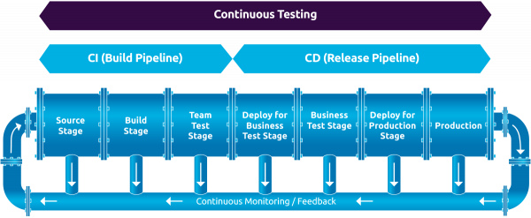

# CI

## What is Continuous Integration and how is it implemented?

Continuous integration is a strategy used by many software developers to catch bugs and errors faster.
The main concept is, that by committing smaller but more frequent changes, that it is easier to check for possible problems than with a lot of changes at once.
This integration method also takes use of the version control, which helps organize and structure the history of a project. 

The integration process itself can be automated or done manually.
For example, Jenkins and GitHub provide tools to write automated pipelines to check the new submitted code for errors. 
These pipelines are also able to build and pack the project, so a consistent output is more likely. 

These strategies help keep everything consistent and improve collaboration and the software quality.

## What are the advantages and disadvantages of CI?

Continuous Integration (CI) makes software development smoother by automatically merging code changes from different developers into a shared space, which helps spot and fix errors early.
It provides real-time feedback, keeps everyone on the same page, and reduces the stress of last-minute integration issues.
CI also keeps the codebase stable, making releases faster and more reliable.
It’s like having a safety net for your code, ensuring that changes are constantly tested and integrated, leading to better quality software.

## What is Continuous Testing and how is it implemented?

### What is Continuous Testing?

**Continuous Testing (CT)** is the practice of executing automated tests continuously throughout the software development lifecycle (SDLC) to get real-time feedback on the risks associated with a software release candidate. It ensures that testing happens early, often, and in an automated way as part of the delivery pipeline, providing immediate feedback on both the functional and business risks related to the software. 

The goal of Continuous Testing is to evaluate not only the technical quality of the code but also its alignment with business expectations and risk tolerance. This ensures that the software is ready for release without requiring lengthy, manual test processes that slow down the development cycle.

### Key Concepts of Continuous Testing

1. **Immediate Feedback**: Continuous Testing ensures that feedback about defects, issues, or risks is given early and frequently throughout the SDLC. This reduces the likelihood of costly fixes later in the cycle.
   
2. **Test Automation**: Continuous Testing relies heavily on automated testing tools, which automatically trigger tests after code changes are committed to the repository. This minimizes human intervention and increases speed and accuracy.

3. **Business Risk Assessment**: Continuous Testing doesn’t just check for functional correctness; it evaluates how well the software aligns with business goals and whether it poses any risk from a business perspective.

4. **Shift-Left Testing**: Testing is integrated earlier in the development cycle (“shift left”), allowing issues to be detected and fixed at a lower cost and with less impact on project timelines.

### Why Continuous Testing is Necessary

In the 2010s, software became a critical business differentiator, with organizations needing to innovate and deliver high-quality software quickly. As Agile, DevOps, and Continuous Delivery became common approaches to speeding up development cycles, testing was identified as a bottleneck due to traditional manual processes. Continuous Testing solves this by:

- Reducing the time needed for testing by automating repetitive tasks.
- Providing fast, continuous feedback, allowing teams to fix issues immediately.
- Aligning testing with business risks, enabling informed go/no-go decisions for releases.

### How Continuous Testing is Implemented

To implement Continuous Testing effectively, several practices and tools must be integrated into the development and testing workflow.


 
#### 1. **CI/CD Pipeline Integration**

Continuous Testing is integrated into **Continuous Integration (CI)** and **Continuous Delivery (CD)** pipelines. These pipelines automate the process of building, testing, and deploying code, ensuring that tests are run at every stage of development. For example:

- **CI Tools**: Jenkins, Travis CI, GitLab CI, CircleCI.
- **CD Tools**: Spinnaker, ArgoCD.

Every time a developer pushes code to the version control system (e.g., GitHub, GitLab), the CI/CD pipeline is triggered, running a set of automated tests to validate the new code. This ensures that code changes are continuously tested as part of the development workflow.

#### 2. **Automated Testing**

Automated tests are critical to Continuous Testing. A variety of tests are run, including:

- **Unit Tests**: These validate individual functions or methods.
- **API Tests**: Focus on validating the functionality and integration of application programming interfaces (APIs).
- **Integration Tests**: Test the interaction between different components or modules of the software.
- **End-to-End (E2E) Tests**: Validate that the entire system works as expected from a user’s perspective.
- **Non-Functional Tests**: Include performance, security, and compliance tests.

Automation tools like **Selenium**, **JUnit**, **Cucumber**, **Postman** (for API testing), and **JMeter** (for performance testing) are used to execute these tests continuously.

#### 3. **Parallel and Distributed Test Execution**

To avoid bottlenecks in the delivery pipeline, automated tests are often run in parallel across multiple environments. This is achieved using:

- **Containerization**: Tools like **Docker** and **Kubernetes** ensure that the testing environment remains consistent, whether tests are run locally or on a remote server.
- **Selenium Grid**: Allows running tests in parallel across different browsers and operating systems.

By distributing tests, teams can minimize execution time and obtain feedback more quickly.

#### 4. **Shift-Left Testing**

Continuous Testing adopts the "shift-left" approach, meaning testing is done earlier in the development process. Instead of waiting until the end of development, tests are written and executed as soon as new code is introduced. 

This practice helps catch issues early, when they are cheaper and easier to fix, and prevents technical debt from accumulating.

#### 5. **Test Data Management**

Managing test data is essential for effective Continuous Testing. Automated tests require consistent and accurate data across all environments to provide meaningful results. **Service Virtualization** and **Mock Servers** can be used to simulate external dependencies, allowing teams to test even when third-party services or databases are unavailable.

#### 6. **Feedback Loops and Metrics**

Continuous Testing generates vast amounts of data on test coverage, code quality, and software health. This data is used to create feedback loops, providing developers and testers with:

- **Reports**: Indicating whether the software is ready to move to the next stage of the pipeline.
- **Metrics**: Insights into the number of defects, test coverage, and performance bottlenecks.

Tools like **SonarQube** and **JaCoCo** are used to generate these reports and ensure the testing process is continuously improved.

### Benefits of Continuous Testing

1. **Faster Feedback**: Continuous Testing provides immediate feedback on the quality of the code and the risks associated with the release candidate. Developers are notified of issues as soon as they occur, enabling quick fixes.
   
2. **Higher Code Quality**: By testing early and frequently, defects are caught before they reach production. This leads to higher-quality software that meets both technical and business requirements.

3. **Reduced Risk**: Continuous Testing assesses the risk to the business, ensuring that the software is aligned with business objectives, performance, security, and compliance standards.
   
4. **Improved Collaboration**: Continuous Testing fosters collaboration between development, testing, and operations teams, encouraging a shared responsibility for quality.

5. **Increased Development Speed**: Automation removes manual testing bottlenecks, enabling teams to release software faster while maintaining high-quality standards.

### Common Challenges in Continuous Testing

1. **Dependency Management**: Modern applications rely on third-party services or components that may not always be available for testing. **Service Virtualization** can help simulate these dependencies, allowing tests to proceed without disruption.

2. **Scalability**: Running continuous tests on large projects can strain infrastructure. Teams may need to use **cloud-based testing environments** or **parallel test execution** to ensure scalability.

3. **Test Maintenance**: As applications evolve, tests need to be updated frequently. **API testing** is preferred over **GUI testing** because APIs are more stable and less prone to changes, reducing the need for constant test maintenance.

4. **Complex Environment Setup**: Testing requires stable, production-like environments. Virtualization and **Containerization** can help create consistent environments for reliable testing.

### Continuous Testing vs Automated Testing

Although Continuous Testing relies on automation, it’s more than just running automated tests. The key differences are:

1. **Business Risk Focus**: Continuous Testing assesses the risk to the business, whereas automated testing might focus only on code correctness.

2. **Integrated Feedback**: Continuous Testing is integrated into the development pipeline, providing real-time feedback. Automated testing is often a standalone process.

3. **End-to-End Quality Process**: Continuous Testing is part of a broader quality process that includes defect prevention, risk analysis, and continuous improvement, whereas automated testing is typically focused on defect detection.

### Continuous Testing in the Context of Our Project: What Makes Sense and What Doesn't?

In our project, we have already implemented a **pipeline** where the build is executed, tests are automatically run, and reports are generated as artifacts. This approach makes sense because it aligns with the principles of **Continuous Testing** by providing immediate feedback on the state of the code, ensuring that issues are identified early in the process.

By running tests as part of the pipeline, we avoid the traditional delays of manual testing and ensure that every build is validated before moving further along the pipeline. The generation of test reports as artifacts allows us to keep track of progress and identify recurring issues. This helps maintain high-quality standards and ensures that we can make informed decisions about the readiness of a release candidate.

This process not only improves efficiency but also reduces the risk of defects progressing further into production. Continuous feedback loops, like the one we've implemented, make sure that any issues are addressed as they arise, ensuring that the final product meets the required standards.

While this pipeline setup works well for our project, we should continually assess whether every step in the process remains efficient and relevant. Some areas to consider:
- Are the tests covering all critical aspects of the application?
- Is there unnecessary redundancy in test execution?
- Can we optimize further by focusing on business-critical tests?

This ongoing evaluation will help us refine the pipeline to ensure it always serves the project's goals effectively.

### Conclusion

Continuous Testing is an essential practice in modern software development, especially in Agile and DevOps environments. By integrating automated tests into the CI/CD pipeline, focusing on business risk, and providing fast feedback loops, Continuous Testing allows teams to deliver high-quality software faster and with more confidence. Through automation, early testing, and feedback loops, it enhances both technical quality and alignment with business goals.


## What is a branching strategy and what are the known ones?

### Branching Strategy in Software Development

In modern software development, **speed** and **agility** are crucial when it comes to developing and releasing software. However, when you have a large team of developers working simultaneously, **branching** and **merging code** can become messy fast. 

Therefore, teams need to have a process in place to implement multiple changes at once. This is where having an **efficient branching strategy** becomes essential for managing development workflows effectively.

### What is a Branching Strategy?

A **branching strategy** is the set of rules and guidelines that software development teams adopt when working with branches in a version control system like Git. Branches allow developers to create independent workspaces for developing features, bug fixes, or experiments without affecting the main codebase. Once the changes are complete, they are merged back into the master or main branch, ensuring a clean and organized development process.

A branching strategy helps:
- Maintain a **stable main branch** for production
- Enable **parallel development** among teams
- Manage releases and ensure a **clear deployment pipeline**
- Minimize **merge conflicts** and maintain a bug-free codebase

### Common Branching Strategies

Several branching strategies are widely used in the software industry, each with its own pros and cons depending on the team's workflow, project size, and release cadence.

#### 1. GitFlow

The **GitFlow** branching strategy is designed for projects that require parallel development and well-defined release cycles. It uses multiple branches to manage features, releases, and hotfixes. Here’s how it works:

- **Master Branch**: Holds the production-ready code.
- **Develop Branch**: Serves as the integration branch for new features.
- **Feature Branches**: Created from the `develop` branch to work on new features.
- **Release Branches**: Help prepare a production release and are merged back into both `develop` and `master`.
- **Hotfix Branches**: Created when an urgent bug fix is required on the production code.


An Image of the basic workflow git workflow. This is the fundamental workflow.

**Pros**:
- Good for handling **multiple versions** of production code.
- Clear separation of concerns (features, releases, and bug fixes).

**Cons**:
- Can become **complex** for smaller teams or projects with frequent releases.
- Slows down development in CI/CD environments due to branching overhead.

#### 2. GitHub Flow

**GitHub Flow** is a simpler alternative to GitFlow and is ideal for smaller teams with a focus on **continuous integration** and **continuous delivery (CI/CD)**. This model emphasizes fast, incremental changes with a single production branch.

- Developers create **feature branches** directly from the `main` branch.
- Once the feature is complete and tested, it is merged back into `main`.
- The `main` branch is always in a deployable state.


An image of a Github workflow when working with branches.

**Pros**:
- **Simple and lightweight**, making it easy for small teams.
- Supports **fast deployment** and quick feedback loops.

**Cons**:
- No explicit development branch, so **production code can become unstable** if changes are not thoroughly tested.
- Less suited for projects requiring **multiple versions** or environments.

#### 3. GitLab Flow

**GitLab Flow** is another simplified alternative to GitFlow but is better suited for projects with multiple environments (e.g., staging, production). The GitLab Flow strategy allows code to pass through internal environments (like staging) before being deployed to production.

- Developers work on **feature branches** that are merged into `main`.
- When the `main` branch is ready for deployment, it is merged into the **production branch**.


Workflow form Gitlab.

**Pros**:
- Provides **isolation between environments**, reducing the risk of deploying unstable code.
- More suited for teams needing multiple deployment environments.

**Cons**:
- Still requires careful management to avoid conflicts between branches.
- May not be suitable for smaller projects or teams.

### Why You Need a Branching Strategy

An effective branching strategy ensures a **smooth development workflow** and helps:
- Improve **productivity** and coordination among developers.
- Enable **parallel workstreams** for faster development.
- Organize **structured releases** without hindering the production environment.
- Maintain a **bug-free** and stable codebase, ensuring quick fixes and releases without disruption.

## How We Implemented Our Branching Strategy

In our project, we adopted a branching strategy to ensure smooth collaboration between teams while maintaining a fast and stable release process. Our strategy allows multiple developers to work on different features in parallel while keeping the main branch stable and deployable at all times.

### Pipeline Integration

We have implemented a pipeline where:
1. **Builds are executed** after code is merged into the `main` branch.
2. **Automated tests** are run to ensure that no new changes break existing functionality.
3. **Reports are generated as artifacts**, helping track the quality of the code and providing insights into potential issues before the final release.

This setup helps us maintain a clean, automated workflow and ensures that we can catch errors early, reducing the risk of merge conflicts or deployment issues.

### Our Branching Flow

1. **Main Branch**: Holds production-ready code.
2. **Develop Branch**: Used for integrating completed features before release.
3. **Feature Branches**: Each new feature or bug fix starts on its own feature branch. Feature branches are numbered and named according to their task (e.g., `36-CI/CD-Theory`). These branches are linked to tickets in our backlog.
4. **Personal Branches**: Each team member has a personal branch for their own journal, where they push only their own work. This branch is used solely for personal notes and experiments.

We do not push changes directly to the `main` branch and do not have a release branch yet as we are not releasing any code at this stage.

### Visual Representation

Here’s a visual representation of how we structured our branching model:


This diagram illustrates the management of the main `develop/Feature`, `Theory`, and `personal` branches, and how code flows from development to production.

By implementing a clear branching strategy and integrating it with our pipeline, we have been able to:
- **Accelerate development** while maintaining quality.
- Ensure that our **main branch is always stable**.
- Allow teams to **work independently** without affecting the main codebase.

## How can commits and branches be linked to user stories?

Commits and branches can be easily linked to user stories through ticket numbers, which act as unique IDs. Tools like Jira and GitLab allow cross-platform linking; for instance, when a ticket is created in Jira, the related branch in GitLab is automatically marked. Even if teams use different ticket systems, adding a short prefix to the ticket number keeps everything unique. Depending on the integration method used, there are different ways to link tickets to branches. 

In our project, we use ticket numbers to identify the correlation between a branch and a ticket. We normally don't use the link feature on GitHub, because it closes the tickets with a closed merge request, which isn't working for our collaboration. 

## What merge strategies are there and how are they implemented?

Merge strategies are crucial for managing how code changes from different branches are combined into a single branch. These strategies help maintain an organized codebase and prevent conflicts during integration. Below is a detailed explanation of common merge strategies and how we implement them in our project.

### Common Merge Strategies

1. **Merge Commit**
   - **Description**: The Merge Commit strategy involves creating a new commit that merges the histories of two branches. This method keeps the entire history of changes, showing a clear record of when branches were merged.
   - **How It Works**: 
     - When you merge a branch into another, Git creates a new merge commit with two parent commits: the latest commits from both branches.
     - This method preserves the context and history of both branches, making it easy to track where changes came from.
   - **Pros**:
     - Full history preservation.
     - Clear understanding of branch integration points.
   - **Cons**:
     - Can clutter the commit history with many merge commits, making it harder to navigate.

2. **Rebase**
   - **Description**: Rebasing involves moving or combining a sequence of commits to a new base commit, effectively rewriting the commit history to create a linear sequence of commits.
   - **How It Works**: 
     - You reapply commits from the source branch onto the target branch, effectively integrating changes in a linear fashion.
     - This process involves re-writing commit history, which can be complex if the branch has already been shared with others.
   - **Pros**:
     - Clean, linear commit history.
     - Easier to navigate and understand the commit history.
   - **Cons**:
     - Can be problematic if the branch being rebased is shared, as it rewrites history and may cause conflicts for others working on the branch.

3. **Squash and Merge**
   - **Description**: Squash and Merge combines all commits from a feature branch into a single commit before merging it into the target branch. This approach simplifies the commit history.
   - **How It Works**: 
     - When merging, you select the “Squash and Merge” option, which consolidates all commits from the feature branch into one.
     - This single commit is then merged into the target branch.
   - **Pros**:
     - Simplified commit history with fewer commits.
     - Easier to maintain a clean history and review changes.
   - **Cons**:
     - Loses individual commit history from the feature branch.
     - May obscure detailed development history if many changes are squashed into one commit.

4. **Fast-Forward Merge**
   - **Description**: Fast-Forward merges move the branch pointer forward to the latest commit in the source branch if there are no intervening commits in the target branch.
   - **How It Works**: 
     - If the target branch is directly behind the source branch with no divergent commits, Git advances the target branch pointer to match the source branch.
   - **Pros**:
     - Maintains a clean, linear history.
     - No additional merge commits are created.
   - **Cons**:
     - Only applicable if there are no new commits in the target branch.
     - May not clearly indicate where branches diverged and merged.

5. **No-FF Merge (No Fast-Forward)**
   - **Description**: The No-FF Merge strategy forces a merge commit even if a fast-forward merge is possible. This method preserves the context of the feature branch.
   - **How It Works**: 
     - Git creates a merge commit even if the target branch could be fast-forwarded.
     - This approach maintains a record of branch integration and helps in tracking feature branch history.
   - **Pros**:
     - Preserves the context and history of feature branches.
     - Useful for tracking complex changes and feature development.
   - **Cons**:
     - Results in a more cluttered commit history with additional merge commits.

### How We Implement Our Merge Strategy

In our project, we adhere to a well-defined merge strategy to ensure clarity and maintain high code quality. Here’s how we implement our merging process:

1. **Commit Message Rules**
   - **Clarity and Conciseness**: Commit messages should be clear and concise, providing a meaningful description of the changes. While we do not have strict character limits, the goal is to make messages informative yet brief.
   - **No Restrictions**: There are no rigid restrictions on message length, but we aim to avoid overly long messages to maintain readability.

2. **GitHub Pull Requests (PRs)**
   - **Creation**: Developers create pull requests (PRs) when they are ready to merge changes from feature branches into the main branch. Each PR should reference relevant tickets or issues from the backlog.
   - **Review Process**: 
     - A designated team member reviews the PR to ensure code quality and adherence to project standards.
     - If issues or improvements are needed, comments are provided on the PR. The PR is not approved until all feedback is addressed and issues are resolved.
   - **Approval**: Once the review is complete and any requested changes are made, the PR is approved by a team member. The approved PR is then merged into the main branch.

3. **Handling Merge Conflicts**
   - **Conflict Resolution**: If merge conflicts occur, developers must resolve them before the PR can be approved. This involves carefully merging conflicting changes and testing to ensure functionality remains intact.
   - **Collaboration**: Developers collaborate to resolve conflicts, ensuring that all relevant changes are incorporated and no functionality is broken.

4. **Pipeline Integration**
   - **Automated Testing**: All feature branches undergo automated testing to verify that new changes do not introduce errors. This helps catch issues early in the development process.
   - **Continuous Integration**: Our CI pipeline ensures that code is continuously integrated and tested, maintaining a stable codebase and reducing the risk of integration issues.

### Visual Representation

Below is a visual representation of how a pull request looks like on Github


This diagram illustrates how our main `master`, `develop`, and `feature` branches interact and how code flows from development through review to production.

## What is Semantic Versioning and How is it Implemented?

### What is Semantic Versioning?

Semantic Versioning (often abbreviated as **SemVer**) is a versioning scheme designed to provide a clear and standardized way of labeling software versions. It helps developers and users understand the changes between software releases by following a structured and predictable format for version numbers. The format typically follows the pattern:

```
MAJOR.MINOR.PATCH
```

Each part of this version number has a specific meaning:

1. **MAJOR Version**:
   - This number is incremented when there are significant, potentially **breaking changes** to the software’s API or functionality.
   - Changes that make older versions incompatible or introduce drastic modifications should result in a major version increase.
   - For example, if the software version moves from `1.0.0` to `2.0.0`, it indicates that the new version is not backward compatible and users should expect breaking changes.

2. **MINOR Version**:
   - The minor version is incremented when **new features** or functionality are added that are **backward compatible** with the previous versions.
   - These changes enhance the software but do not break existing functionality. Users can upgrade without fear of existing features no longer working.
   - For example, moving from `1.1.0` to `1.2.0` means new features have been added, but the overall compatibility remains unchanged.

3. **PATCH Version**:
   - The patch version is incremented for **backward-compatible bug fixes** or small improvements that do not affect the functionality of the software.
   - Patch releases address minor issues such as bugs, security vulnerabilities, or performance improvements that do not introduce new features.
   - For example, `1.1.1` to `1.1.2` would indicate a patch release to fix bugs without any feature changes.

### Why Use Semantic Versioning?

Semantic Versioning is widely adopted because it provides:

- **Clarity**: Users and developers can quickly understand the scope of changes based on the version number.
- **Predictability**: It ensures that software updates follow a predictable pattern, making it easier to manage dependencies and plan upgrades.
- **Compatibility Management**: With SemVer, users can be confident that minor and patch updates won’t break their existing code, while major updates signal potential breaking changes.

### How is Semantic Versioning Implemented?

#### 1. **Initial Versioning**
   - A project typically starts at version `1.0.0`. However, during the initial development phases (before the software is ready for production), versions may start with `0.x.x` to indicate the software is still in an unstable or experimental phase.
   - Any `0.x.x` version should be treated as unstable, and the API may change without prior notice.

#### 2. **Making Changes to Version Numbers**

   The process for determining how to update a version number when making changes follows this general rule:

   - **MAJOR** version increment (`x.0.0`):
     - If any change **breaks backward compatibility** or modifies the API in a way that existing users need to update their code to continue using it, increment the MAJOR version.
     - Examples: Removing or renaming an API endpoint, changing how core functionality behaves.

   - **MINOR** version increment (`0.x.0`):
     - If new features or functionalities are added that are **backward compatible**, increment the MINOR version.
     - Examples: Adding new API endpoints, introducing new options that don’t affect existing ones.

   - **PATCH** version increment (`0.0.x`):
     - If **bug fixes**, **security patches**, or **minor performance improvements** are made, increment the PATCH version.
     - Examples: Fixing a bug in a function, resolving a security vulnerability.

#### 3. **Pre-Release and Build Metadata**

   Semantic Versioning also allows for pre-release versions and build metadata to be included in the version string. These extensions help with versioning during development cycles or when releasing specific builds for testing purposes.

   - **Pre-Release Versions**: Versions can be marked as pre-release by appending a hyphen and additional identifiers. For example:
     - `1.0.0-alpha`
     - `1.0.0-beta`
   - These versions signal that the software is not yet production-ready and may still undergo changes.
   
   - **Build Metadata**: Additional build information can be appended using a `+` sign, like so:
     - `1.0.0+build20210909`
     - This does not affect the version ordering but can provide more context about the specific build.

#### 4. **Version Management in Development**
   - In a team or CI/CD environment, semantic versioning is typically automated through version control systems like Git, and tools that automatically tag releases (e.g., GitHub’s release tools, or CI pipelines) are integrated to enforce the SemVer rules.
   - Developers update the version number manually based on the nature of their changes, ensuring it follows the MAJOR.MINOR.PATCH pattern.
   - When a version is tagged and released (often accompanied by release notes), the next development cycle begins on a new version that may include minor or patch-level updates as needed.

### Example of Semantic Versioning in Action

Consider a software project with the following version history:

1. **1.0.0**: Initial stable release of the software.
2. **1.1.0**: A new feature is introduced, but backward compatibility is maintained.
3. **1.1.1**: A bug in the new feature is fixed, and a patch is released.
4. **2.0.0**: The API undergoes a major redesign, breaking backward compatibility. The MAJOR version is incremented to signal this change.

### Best Practices for Semantic Versioning

- Always update the version number **before** releasing any changes.
- Keep a **changelog** to document which changes correspond to each version increment.
- Ensure all team members understand and follow the rules of semantic versioning, especially regarding backward compatibility.
- Use pre-release tags for unstable or experimental features (e.g., `2.0.0-beta.1`).
- If in doubt, be conservative: prefer minor and patch updates unless a breaking change is unavoidable.

## What is the Difference Between Monorepo and Multirepo (Especially in the Context of Microservices)?

### Monorepo

A **monorepo** (short for monolithic repository) is a software development strategy where all code for different services, libraries, or components of a project is stored in a **single version-controlled repository**. This means that a single repository contains code for multiple services or even the entire project.

#### Key Characteristics:
- **Single repository**: All microservices, components, and libraries are stored together in one repository.
- **Shared tooling and dependencies**: Since everything is in one repository, dependencies between services and libraries are often easier to manage, and tooling (e.g., linting, build processes) can be applied consistently across the entire project.
- **Centralized versioning**: All services are versioned together, making it easier to manage compatibility between different parts of the system.
- **Code visibility**: Developers have access to the entire codebase, enabling them to understand how different parts of the system interact and improving cross-team collaboration.

#### Advantages:
1. **Simplified Code Sharing**: When microservices share common libraries or utilities, they can easily reference each other, reducing duplication and ensuring consistency.
2. **Consistency Across Services**: It is easier to enforce coding standards, linters, or build tools across all microservices.
3. **Atomic Changes**: Changes that span multiple services or components (e.g., refactoring or updating a shared library) can be done atomically within a single pull request, ensuring all dependencies are aligned.

#### Disadvantages:
1. **Scalability Issues**: As the number of microservices grows, managing a single large repository can become challenging in terms of build time, code navigation, and repository size.
2. **Complex CI/CD Pipelines**: With many microservices in one repository, pipelines need to be designed to handle different services being built and deployed separately without affecting unrelated parts of the code.
3. **Access Control**: Fine-grained access control is harder to implement in a monorepo since everyone has access to the entire codebase.

### Multirepo

A **multirepo** (or multiple repositories) strategy involves storing the code for each service, library, or component in **separate repositories**. Each microservice typically has its own independent version control repository, with its own CI/CD pipeline, tooling, and versioning strategy.

#### Key Characteristics:
- **Separate repositories**: Each microservice or component is stored in its own version-controlled repository.
- **Independent versioning**: Each service or library can be versioned and deployed independently, reducing the risk of one service affecting others.
- **Isolated development**: Teams can work on their specific microservice independently of other teams, leading to better modularity and separation of concerns.
- **Granular control**: Access control, CI/CD pipelines, and testing strategies can be tailored to each service individually.

#### Advantages:
1. **Independent Deployment and Versioning**: Microservices can evolve independently. Teams can deploy updates to their services without worrying about the impact on others, leading to faster release cycles.
2. **Modular Structure**: Microservices are more loosely coupled, reflecting the microservices architecture itself, and each repository is self-contained.
3. **Simpler CI/CD**: Each repository has its own CI/CD pipeline tailored to the needs of the specific service, leading to simpler and faster builds for each service.

#### Disadvantages:
1. **Code Duplication**: Since services are in separate repositories, sharing common code between microservices can be more challenging, potentially leading to duplication of logic or code.
2. **Cross-Service Coordination**: Coordinating changes across multiple services (such as a shared API contract update) becomes harder when each service is managed in its own repository.
3. **Tooling Overhead**: Separate repositories often mean maintaining separate configurations for CI/CD, testing, and version control, which increases overhead for developers and DevOps teams.

### Monorepo vs. Multirepo in Microservices Context

Microservices architecture emphasizes the **independence** and **modularity** of each service. The choice between monorepo and multirepo directly impacts how these services are developed, deployed, and maintained.


#### When to Use Monorepo for Microservices:
- **Tightly coupled microservices**: When microservices are highly interdependent and share many libraries, a monorepo can simplify the process of managing shared code and deploying changes.
- **Unified build tooling**: If the microservices require the same build, test, and deploy tools, a monorepo allows you to centralize and standardize this.
- **Cross-team collaboration**: In scenarios where teams frequently collaborate across services or require visibility into the entire system, a monorepo can encourage transparency and ease of collaboration.

#### When to Use Multirepo for Microservices:
- **Independent microservices**: If microservices are highly independent and have few shared dependencies, a multirepo allows each team to manage their services autonomously.
- **Scaling issues**: As the number of services grows, the monorepo may become too large and unwieldy. A multirepo ensures that the growth of one service doesn’t impact the others.
- **Isolated teams**: If each microservice is owned by a different team, with minimal overlap in development responsibilities, a multirepo structure supports this by giving each team ownership of their own repository.

### Conclusion

The choice between **monorepo** and **multirepo** for microservices depends on the needs of the project, team structure, and level of service independence. While monorepos offer simpler code sharing and atomic changes, they can become difficult to scale as the number of services grows. Multirepos, on the other hand, provide better isolation and modularity, but may require more effort to manage shared dependencies and cross-service changes.

## What is an Artifact Repository and What Role Does It Play in Your Process?

### What is an Artifact Repository?

An **artifact repository** is a specialized type of repository designed to store, version, and manage **binary files** (also known as artifacts) that are produced during the software development and build process. Artifacts typically include compiled code, libraries, packages, Docker images, configuration files, and other essential assets that are necessary for deploying or running software.

Unlike source code, which is stored in a **version control system (VCS)** like Git, artifacts are the end-products of the build process. They are stored separately in an artifact repository for future use, allowing teams to manage these artifacts independently of the source code.

Common artifact repository tools include:
- **JFrog Artifactory**
- **Sonatype Nexus**
- **Azure Artifacts**
- **GitHub Packages**
- **AWS CodeArtifact**

### Types of Artifacts:

Artifacts stored in an artifact repository can include:
- **Compiled binaries** (e.g., `.jar`, `.dll`, `.exe` files)
- **Docker images** (containerized application builds)
- **Packages and libraries** (e.g., Node.js packages, Python wheels, NuGet packages)
- **Helm charts** (for Kubernetes deployments)
- **Configuration files** (e.g., `.yaml`, `.json`, `.properties`)
- **Build metadata** (information related to builds, such as commit hash, version numbers, etc.)

### Role of Artifact Repository in the Development Process

An artifact repository plays a **crucial role** in streamlining and improving the development, testing, and deployment process. Here's how it fits into the overall workflow:

#### 1. **Storage and Versioning of Build Artifacts**

The artifact repository is where all the binary files produced by the build process are stored. Each version of an artifact is saved with a unique identifier, allowing for versioning and retrieval of specific versions when needed. This is particularly useful when you need to:
- Roll back to a previous version of the software.
- Debug issues in older versions.
- Test against specific artifact versions.

#### 2. **Dependency Management**

In microservices or modular development, various components or services often rely on shared libraries or dependencies. An artifact repository helps manage these dependencies in a central location. Instead of developers compiling libraries from scratch each time, they can fetch pre-built binaries from the repository.

For example:
- In a Node.js environment, dependencies are downloaded from the artifact repository using package managers like npm.
- In a Java environment, dependencies are managed via Maven or Gradle, which pulls the required JAR files from the artifact repository.

#### 3. **CI/CD Pipeline Integration**

Artifact repositories are tightly integrated with **Continuous Integration (CI)** and **Continuous Deployment (CD)** pipelines. After the CI process runs and successfully builds the software, the resulting artifact is pushed to the repository. In the deployment phase, the CD pipeline pulls the appropriate version of the artifact from the repository for deployment into production or staging environments.

The artifact repository acts as a **single source of truth** for any binaries that are being deployed. This ensures that the same artifact is consistently used across multiple environments, reducing the chances of "it works on my machine" scenarios.

#### 4. **Release and Distribution Management**

When a software product is ready for release, the final build artifact is stored in the artifact repository. The repository allows for **access control**, where only authorized users or systems can access or download certain artifacts.

In addition to storage, artifact repositories provide mechanisms for **distribution**. For example, Docker images may be distributed via Docker registries (a type of artifact repository), while Java libraries can be distributed via repositories like Maven Central.

#### 5. **Security and Compliance**

Artifact repositories help maintain the security and integrity of the artifacts being used and distributed. By managing access to specific versions of artifacts, the repository ensures that only vetted, tested, and approved binaries are deployed to production. It also helps with compliance and auditing by:
- Tracking which versions of a particular artifact were deployed and when.
- Providing a history of changes and updates made to artifacts over time.

#### 6. **Caching for Efficiency**

Artifact repositories often act as **proxies** for public repositories (e.g., npm, Maven Central, Docker Hub). Instead of downloading dependencies from the internet every time, the repository caches these artifacts locally. This reduces the time spent downloading the same dependencies and helps speed up builds and deployments.

### Example of How We Use an Artifact Repository

In our process:
1. **Build Phase**: Once the source code is pushed and a pull request is merged, our CI pipeline automatically builds the code and generates artifacts. These could be JAR files (for Java projects), Docker images, or packaged binaries.
   
2. **Artifact Storage**: The generated artifacts are automatically pushed to our artifact repository. We store each artifact with metadata like build version, commit ID, and the environment for which it was built (development, staging, or production).

3. **Dependency Management**: During development, microservices can pull shared libraries or dependencies from the repository, ensuring that they’re using the correct and most up-to-date versions.

4. **Deployment**: Our CD pipeline pulls the artifacts from the repository and deploys them to the appropriate environment (e.g., staging, production). The repository guarantees that the exact artifact that was tested in staging is the one that is deployed to production.

5. **Version Control and Rollbacks**: If an issue arises in production, we can easily roll back to a previous version of the artifact stored in the repository, minimizing downtime and disruption.

### Conclusion

In summary, an **artifact repository** plays a vital role in the software development lifecycle by managing the storage, versioning, and distribution of build artifacts. It ensures consistency across environments, simplifies dependency management, and integrates seamlessly with CI/CD pipelines. By using an artifact repository, teams can streamline their development processes, improve collaboration, and ensure that only tested, secure artifacts are deployed to production.

## Sources

- [Devcycle](https://devcycle.com/blog/pros-and-cons-explored-continuous-integration-deployment) was used for information.
- [Ionos](https://www.ionos.com/digitalguide/websites/web-development/continuous-integration/) was used for information.
- [ABTasty](https://www.abtasty.com/blog/git-branching-strategies/) was used for gathering information for branching strategy.
- [Wikitesting](https://en.wikipedia.org/wiki/Continuous_testing) was used for gathering information on Continious Testing
- [Chatgpt](https://openai.com/chatgpt/) was used for spelling correction.
- [MonoRepo](https://monorepo.tools/) Was used to gather information on what monorepo is.

